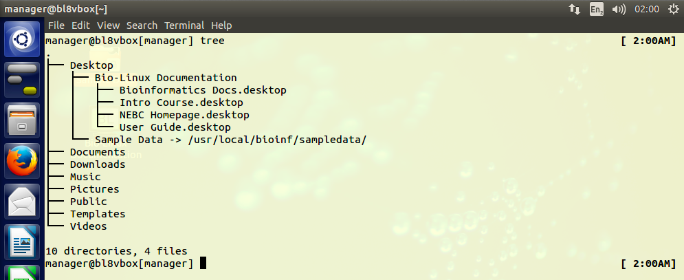
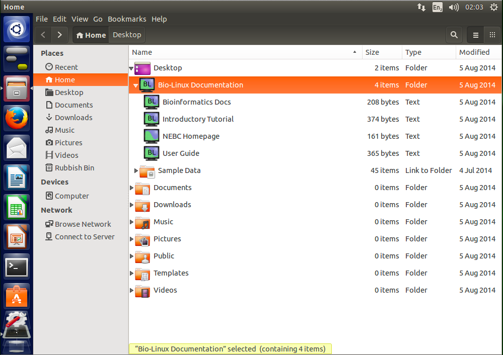
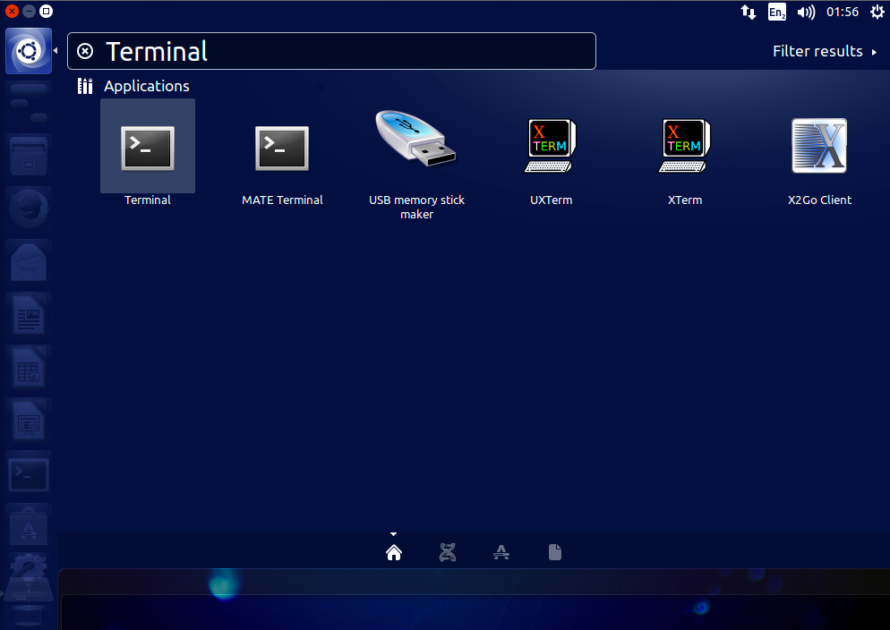
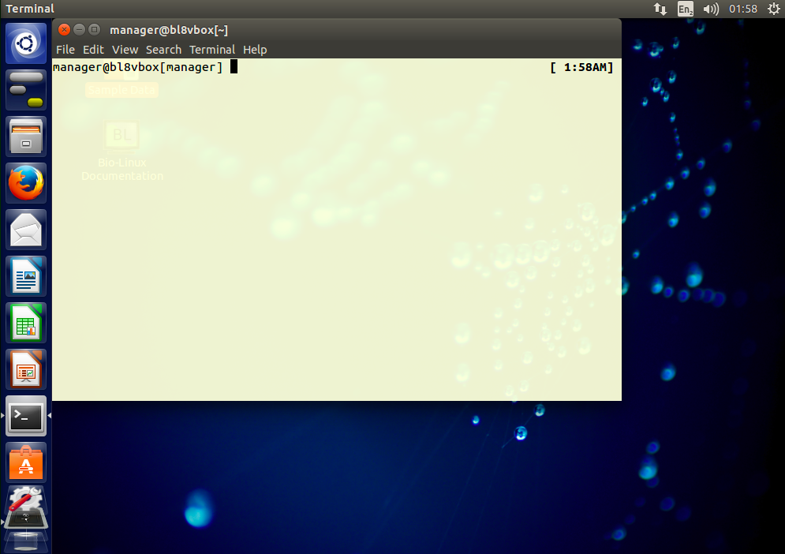
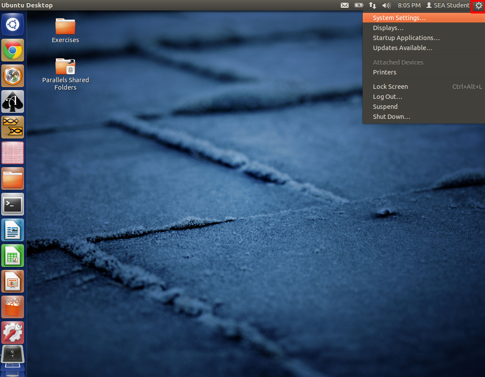
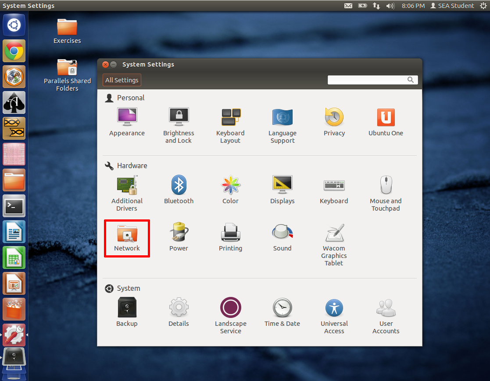
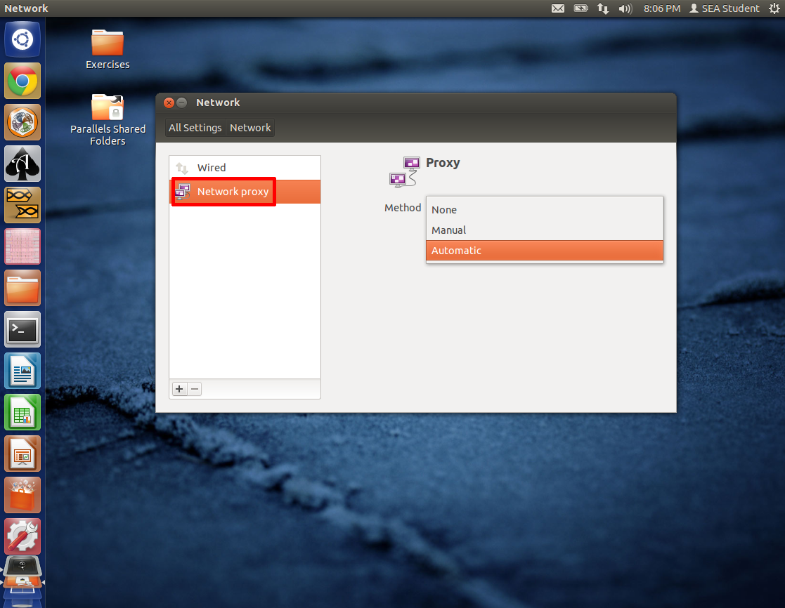

# An introduction to the command-line interface

## 1.0 Preface
This tutorial is based on a Linux/Unix _command-line_. Using the _command-line_ requires a Linux/Unix operating system. The easiest way to try out a Linux system without actually installing it on your computer is a [LiveCD](https://en.wikipedia.org/wiki/Live_CD). A LiveCD is a CD/DVD that you prepare (e.g. burn a Linux distribution on it) and insert in your computer. You would restart you computer and can run Linux from the CD/DVD without any installation requirements. This is helpful for trying out a distribution of Linux, not for actual work.

Another route would be to use a virtual machine. A virtual computer that runs within your normal host system, e.g. Windows or MacOSX. The software to create a virtual machine is free, e.g. [VirtualBox](https://www.virtualbox.org/).

Common flavors of Linux ready for download are e.g. [Ubuntu](https://help.ubuntu.com/community/LiveCD) or if you are thinking of going the bioinformatics route, [BioLinux](http://environmentalomics.org/bio-linux/), which includes many pre-installed bioinformatics tools (this is also the distribution we will be using).

A PDF-version of this tutorial can be downloaded [here](doc/AnIntroductionToTheCLI_sschmeier.pdf) or at [http://sschmeier.com/bioinf-workshop/cli/doc/AnIntroductionToTheCLI_sschmeier.pdf](http://sschmeier.com/bioinf-workshop/cli/doc/AnIntroductionToTheCLI_sschmeier.pdf).

An accompanying lecture for this tutorial is available at [figshare](http://dx.doi.org/10.6084/m9.figshare.1506799) ([http://dx.doi.org/10.6084/m9.figshare.1506799](http://dx.doi.org/10.6084/m9.figshare.1506799)).

## 1.1 Learning outcomes
1. Be able to operate comfortably the command-line.
2. Be able to navigate the unix directory structure on the command-line.
3. Be able to start command-line programs and getting help/information about programs.
4. Be able to investigate text files with command-line commands.
5. Be able to investigate the content of text-files on the command-line.
6. Be able to explain the concept of a unix pipe.

## 1.2 Introduction
This is a collection of commands and programs I put together for working under Linux/Unix shells. It is not comprehensive. It includes very basic stuff. Tutorial style. This is bash syntax but most of it will work on other shells (tcsh, sh) as well.

What is a shell? Here I shamelessly quote [Wikipedia](https://goo.gl/g9x4tE):

> "In computing, a shell is a user interface for access to an operating system's services. In general, operating system shells use either a command-line interface (**CLI**) or graphical user interface (GUI), depending on a computer's role and particular operation..."

> "**CLI** shells allow some operations to be performed faster in some situations, especially when a proper GUI has not been or cannot be created. However, they require the user to memorize all commands and their calling syntax, and also to learn the shell-specific scripting language, for example bash script."

## 1.3 The Ubuntu Linux desktop environment
The default environment in Ubuntu is called Unity and is similar to other user interfaces found in Windows or MacOSX (*see Figure 1*).

*Figure 1: The BioLinux desktop environment Unity.*

## 1.4 Some words regarding the Linux file-system
The directory structure in a Linux system is not much different from any other system you worked with, e.g. Windows, MacOSX. It is essentially a tree structure (*see Figure 2*).

*Figure 2: Quick look at the directory tree structure on the command-line.*

To navigate the file-system you can use a file-manager e.g. "Files" the default file manager in the Unity window manager used by BioLinux (*see Figure 3*).

*Figure 3: Quick look at the directory tree structure in the "Files" GUI.*

However, on the command-line we navigate via commands and not via mouse clicks.  Why is it necessary to use the command-line in the first place? Strictly speaking it is not, if you do not want to make use of programs on the command-line. However, the power of the Linux system becomes only obvious once we learn to make use of the command-line, thus navigating the directory structure via commands is one of the **most important skills** for you to learn.

## 1.5 Open a terminal
Open a terminal window and you are are ready to go. On your linux desktop find: **Application** --> **Accessories** --> **Terminal** (for Gnome environment) or type "Terminal" in the search box (*see Figure 4*).

*Figure 4: Unity search bar.*

*Figure 5* shows an example of how a terminal window might look like (it is very easy to change its appearance). You will se this window to execute the commands to work with files and biological data. However, it is by no means restricted to "biological data", once you know how to handle the command-line many tasks based on files will be easily achieved using various programs available here.

*Figure 5: An example of a terminal window in Unity.*

Hint! The command-line prompt (usually "**$**") indicates that the shell/terminal is waiting for commands from us. These it will send to the computer to execute. As long as you do not see the prompt, the computer is busy processing your request.

## 1.6 Proxy settings
You might encounter problems connecting to the internet. So this is most likely the case if your university has restrictions in place to make the network more secure. One of these measures to make a network more secure is a proxy. However, we need the internet. Follow these steps to get connected.

### 1. Open system settings

*Figure 6: Accessing the system settings.*

### 2. Open network settings

*Figure 7: Accessing network settings.*

### 3. Change proxy settings to automatic

*Figure 8: Changing proxy settings.*

After changing the proxy settings to automatic you can open a web-browser and you should be asked for you network *username* and *password*. After you typed those and hit *Enter*, you should be connected.

## 2.0 Let's get started
Pre-2016 you would find my own introductory course in this place. However, since 2016 we will be using the excellent material from the [Software Carpentry](http://software-carpentry.org) Foundation. I am a SWC affiliated volunteer instructor and we are teaching basic computer skills to scientists, with the goal of  general computational up-skilling in the sciences. The material is created in a collaborative manner and tested over and over in many workshops.

Please follow the link to the material **[HERE](shell-novice/index.html)** and have the webpage open. Otherwise you will work in the terminal window aka the shell.

*******************************
**_File: index.md - PDF-version: [link1](http://sschmeier.com/bioinf-workshop/cli/doc/AnIntroductionToTheCLI_sschmeier.pdf) | [link2](doc/AnIntroductionToTheCLI_sschmeier.pdf)- Sebastian Schmeier - Last update: 2016-02-25_**
