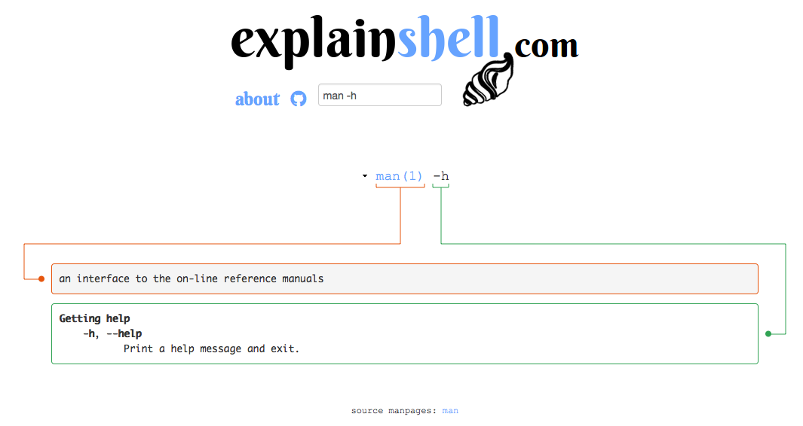
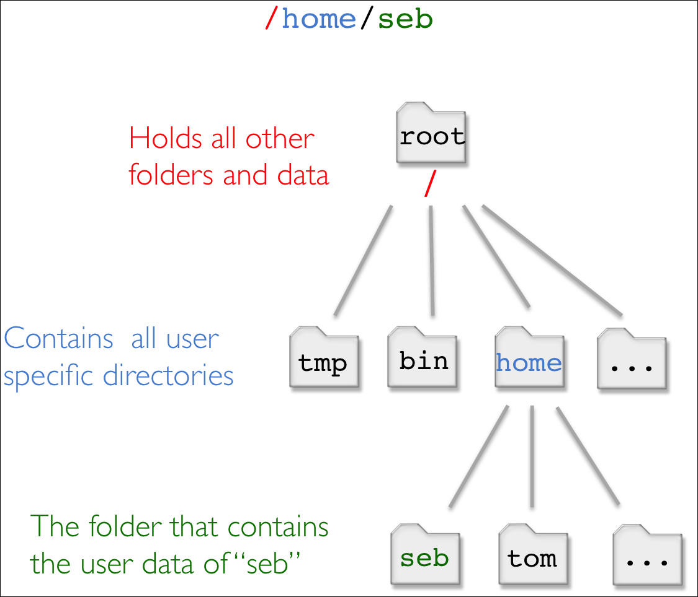

# An introduction to the command-line interface

## 1.0 Preface
This tutorial is based on a Linux/Unix _command-line_. Using the _command-line_ requires a Linux/Unix operating system. The easiest way to try out a Linux system without actually installing it on your computer is a [LiveCD](https://en.wikipedia.org/wiki/Live_CD). A LiveCD is a CD/DVD that you prepare (e.g. burn a Linux distribution on it) and insert in your computer. You would restart you computer and can run Linux from the CD/DVD without any installation requirements. This is helpful for trying out a distribution of Linux, not for actual work.

Another route would be to use a virtual machine. A virtual computer that runs within your nomal host system, e.g. Windows or MacOSX. The software to create a virtual machine is free, e.g. [VirtualBox](https://www.virtualbox.org/).

Common flavors of Linux ready for download are e.g. [Ubuntu](https://help.ubuntu.com/community/LiveCD) or if you are thinking of going the bioinformatics route, [BioLinux](http://environmentalomics.org/bio-linux/), which includes many pre-installed bioinformatics tools (this is also the distribution we will be using).

A PDF-version of this tutorial can be downloaded [here](doc/AnIntroductionToTheCLI_sschmeier.pdf) or at [http://sschmeier.github.io/bioinf-workshop/cli/doc/AnIntroductionToTheCLI_sschmeier.pdf](http://sschmeier.github.io/bioinf-workshop/cli/doc/AnIntroductionToTheCLI_sschmeier.pdf).

An accompanying lecture for this tutorial is available at [figshare](http://dx.doi.org/10.6084/m9.figshare.1506799) ([http://dx.doi.org/10.6084/m9.figshare.1506799](http://dx.doi.org/10.6084/m9.figshare.1506799)).

## 1.1 Learning outcomes
1. Be able to operate comfortably the command-line.
2. Be able to navigate the unix directory structure on the command-line.
3. Be able to start command-line programs and getting help/information about programs.
4. Be able to investigate text files with command-line commands.
5. Be able to investigate the content of text-files on the command-line.
6. Be able to explain the concept of a unix pipe.

## 1.2 Introduction
This is a collection of commands and programs I put together for working under Linux/Unix shells. It is not comprehensive. It includes very basic stuff. Tutorial style. This is bash syntax but most of it will work on other shells (tcsh, sh) as well.

What is a shell? Here I shamelessly quote [Wikipedia](https://goo.gl/g9x4tE):

> In computing, a shell is a user interface for access to an operating system's services. In general, operating system shells use either a command-line interface (**CLI**) or graphical user interface (GUI), depending on a computer's role and particular operation... 

> **CLI** shells allow some operations to be performed faster in some situations, especially when a proper GUI has not been or cannot be created. However, they require the user to memorize all commands and their calling syntax, and also to learn the shell-specific scripting language, for example bash script.

## 1.3 The BioLinux desktop environment
The default environment is called Unity and is similar to other unser interfaces found in Windows or MacOSX (*see Figure 1*).


*Figure 1: The BioLinux desktop environment Unity.*

## 1.4 Some words regarding the Linux file-system
The directory structure in a Linux system is not much different from any other system you worked with, e.g. Windows, MacOSX. It is essentially a tree structure (*see Figure 2*).


*Figure 2: Quick look at the directory tree structure on the command-line.*


To navigate the file-system you can use a file-manager e.g. "Files" the default file manager in the Unity window manager used by BioLinux (*see Figure 3*).


*Figure 3: Quick look at the directory tree structure in the "Files" GUI.*

However, on the command-line we navigate via commands and not via mouse clicks.  Why is it necessary to use the command-line in the first place? Strictly speaking it is not, if you do not want to make use of programs on the command-line. However, the power of the Linux system becomes only obvious once we learn to make use of the command-line, thus navigating the directory structure via commands is one of the **most important skills** for you to learn.

## 1.5 Open a terminal
Open a terminal window and you are are ready to go. On your linux desktop find: **Application** --> **Accessories** --> **Terminal** (for Gnome environent) or type "Terminal" in the search box (*see Figure 4*).


*Figure 4: Unity search bar.*

*Figure 5* shows an example of how a terminal window might look like (it is very easy to change its appearance). You will se this window to execute the commands to work with files and biological data. However, it is by no means restricted to "biological data", once you know how to handle the command-line many tasks based on files will be easily achieved using various programs available here.


*Figure 5: An example of a terminal window in Unity.*

Attention! From here on there will be no more images from the command-line but a **_grey_** window (like the one below this box) that denotes the terminal window. A line starting with the "**$**" command-line prompt in the grey box means this is command-line code and you can paste it (without the **$**) into the command-line and hit "Enter" to run it. If you see a "**#**" at the start of a line, this denotes a comment.

Hint! The command-line prompt (usually "**$**") indicates that the shell/terminal is waiting for imut from us, that it will send to the computer to execute. As long as you do not see the prompt, the computer is busy processing your request.

```bash
# A grey window like this is the command-line window
# This here are comments and just below the line denotes command-line prompt
# at which we enter commands.
$
```

## 2.0 Getting help about command-line programs
This is likely a task you will perform quite often, so it is good that you know how to do it.

Hint! The program `man` is your most important friend.

With `man` getting help is as easy as:

```bash
$ man pwd
```

```bash
WD(1)                    BSD General Commands Manual                   PWD(1)

NAME
     pwd -- return working directory name

SYNOPSIS
     pwd [-L | -P]

DESCRIPTION
     The pwd utility writes the absolute pathname of the current working
     directory to the standard output.

     Some shells may provide a builtin pwd command which is similar or identical
     to this utility.  Consult the builtin(1) manual page.
.
.
.
```

Hint! You can navigate the view down with "j"  and up with  "k". You exit the view with "q".

Lets look at the manual pages of `man` itself:

```bash
$ man man
```

```bash
man(1)                                                                  man(1)

NAME
       man - format and display the on-line manual pages

SYNOPSIS
       man  [-acdfFhkKtwW] [--path] [-m system] [-p string] [-C config_file] 
       [-M pathlist] [-P pager] [-B browser] [-H htmlpager] [-S section_list]
       [section] name ...

DESCRIPTION
       man formats and displays the on-line manual pages.  If  you  specify
       section,  man only  looks in that section of the manual.  name is
       normally the name of the manual page, which is typically the name of
       a command, function,  or  file.
.
.
.
```

Another very helpful resource is the [explainshell.com ](http://www.explainshell.com) webpage, that lets you write down a _command-line_ to see the help text that matches each argument (*see Figure 6*).


*Figure 6: Screenshot of the explainshell.com website.*

## 2.1 Navigating the directory tree on the command-line
This is possibly one of the most important skills you need to learn. You need to understand where you are in the file-system, how to get to a certain directory that contains the files/programs you want to work with.

### 2.1.1 Identify the current directory path / Where am I? (`pwd`)

```bash
# What directory am I in?
# Find out using the "pwd" command (print name of current/working directory)
$ pwd
/home/seb
# you should see something like /home/yourusername
```
Lets try to understand what `/home/seb` means in relation to the file-system. *Figure 7* shows what the individual elements in `/home/seb` mean.


*Figure 7: The directory structure of /home/seb.*

Note! "`/`" can have two meanings. At the beginning of the path it denotes the `root` folder, whereas in the middle in just denotes a separator of two directories.

### 2.1.2 Investigate directories / list directory content (`ls`)

```bash
# list the current directory elements implicitly
$ ls
Desktop  Documents  Downloads  Music  Pictures  Public  Templates  Videos

# the same in a nicer format
$ ls -l
total 32
drwx------ 3 manager manager 4096 Aug  5  2014 Desktop
drwxr-xr-x 2 manager manager 4096 Aug  5  2014 Documents
drwxr-xr-x 2 manager manager 4096 Aug  5  2014 Downloads
drwxr-xr-x 2 manager manager 4096 Aug  5  2014 Music
drwxr-xr-x 2 manager manager 4096 Aug  5  2014 Pictures
drwxr-xr-x 2 manager manager 4096 Aug  5  2014 Public
drwxr-xr-x 2 manager manager 4096 Aug  5  2014 Templates
drwxr-xr-x 2 manager manager 4096 Aug  5  2014 Videos

# List the content of a particular directory (e.g. Desktop/) explicitly
$ ls -l Desktop/
total 4
drwxr-xr-x 2 manager manager 4096 Aug  5  2014 Bio-Linux Documentation
lrwxrwxrwx 1 manager manager   29 Aug  5  2014 Sample Data ->
/usr/local/bioinf/sa
mpledata/
```

### 2.1.3 Moving around in the file system / changing directories (`cd`)

```bash
# Where am I?
$ pwd
/home/seb
# change into directory "Desktop" explicitly with command "cd" (change directory)
$ cd /home/seb/Desktop
# Where am I?
$ pwd
/home/seb/Desktop 
# you moved to the Desktop directory

# Go to your home directory from any position in the directory tree
$ cd
# Where am I?
$ pwd
/home/seb

# A shortcut for the home directory is ~/
# This command will change to /home/user/Desktop from any position in
# the directory tree.
$ cd ~/Desktop
$ pwd
/home/seb/Desktop

# Go one directory up in the directory tree with the ".." operator
$ cd ..
# Where am I?
$ pwd
/home/seb

# Go two directories up in one go
$ cd ../..
# Where am I?
$ pwd
/
# Now you are at the file-system root

# Back to home directory
$ cd
```

Find here more information on "Files and Directories" from the excellent Software carpentry: ["Files and Directories"](http://www.youtube.com/watch?v=qrkvcX4HmYo)

[](http://www.youtube.com/watch?v=qrkvcX4HmYo)

## 2.2 File/Directory-handling

### 2.2.1 Create an empty directory (`mkdir`)

```bash
# Lets create a directory with the program "mkdir"
$ mkdir temp
```

### 2.2.2 Create a new empty text-file (`touch`)

```bash
# first change into the temp directory
$ cd temp
$ ls
total 0
# now create empty file
$ touch file1.txt
# list directory content
$ ls
file1.txt
```

### 2.2.3 Copy files/directories (`cp`)

```bash
# create empty file again
$ touch file1.txt
$ ls -l
total 4
-rw-rw-r-- 1 seb seb 0 Jul 17 17:45 file1.txt
$ cp file1.txt file2.txt
$ ls
file1.txt  file2.txt
$ ls -l
total 4
4 -rw-rw-r-- 1 seb seb 0 Jul 17 17:45 file1.txt
0 -rw-rw-r-- 1 seb seb 0 Jul 17 17:46 file2.txt

# back to home directory
$ cd
# copy temp to temp2
# -r stands for recursive
$ cp -r temp1 temp2
```

### 2.2.4 Move a file/directory (`mv`)

```bash
$ pwd
/home/seb/temp
$ ls
file1.txt  file2.txt
# move files
$ mv file1.txt file3.txt
$ ls
file2.txt  file3.txt
# move directories
$ mv dir1 dir2
# will not work because we miss "dir1"
```

### 2.2.5 Delete a file/directory (`rm`)

```bash
$ cd temp
# delete a file explicitly
$ rm file1.txt
# delete all files starting with "file"
$ rm file*
```

Warning! Avoid using `rm *`, as this will erase all files in the directory.

```bash
# Delete a whole directory.
# Back to the home directory
$ cd
# Where am I?
$ pwd
/home/seb
# -r stands for recursive
$ rm -r temp2/
```

Warning! Deleting files with the `rm` command does really delete them. They are not moved to a trash can, they are gone forever, thus take care of what you delete.

### 2.2.6 Estimate space usage of files and directories (`du`)

```bash
# -h for human readable
$ du -h Desktop
20K	Desktop/Bio-Linux Documentation
24K	Desktop
```

## 2.3 Investigate files
Note! Download two sample-files from here: [file1.txt](http://sschmeier.github.io/bioinf-workshop/cli/data/file1.txt) and [file2.txt](http://sschmeier.github.io/bioinf-workshop/cli/data/file2.txt) or alternatively here: [file1.txt](data/file1.txt) and [file2.txt](data/file2.txt).

Put them in the "temp" directory you created or somewhere else where you find them easily on the command-line.

### 2.3.1 Look into files (`less`)

```bash
$ less file1.txt
```

Hint! Move a line down with "j", up with "k", and you can get out of the view with "q".


### 2.3.2 Print the head/tail of files (`head` and `tail`)

```bash
# first 2 lines
$ head -2 file1.txt
AA,1,2,3,4
CC,9,10,11,12
# last 3 lines
$ tail -3 file1.txt
CC,9,10,11,12
BB,5,6,7,8
AAA,13,14,15,16
```

Note! Here we see for the first time another important concept of programs on the command-line. many of them print the results to what is called "standard-out", which in our case currently is the terminal window.

### 2.3.3 Concatenate content of files (`cat`)

```bash
$ cat file1.txt file2.txt
AA,1,2,3,4
CC,9,10,11,12
BB,5,6,7,8
AAA,13,14,15,16
ZZZ,9,10,11,12
XXX,1,2,3,4
YYY,5,6,7,8
BB,5,6,7,8
# all files starting with "file":
$ cat file*
AA,1,2,3,4
CC,9,10,11,12
BB,5,6,7,8
AAA,13,14,15,16
ZZZ,9,10,11,12
XXX,1,2,3,4
YYY,5,6,7,8
BB,5,6,7,8
# print content from one file to stdout:
$ cat file1.txt
AA,1,2,3,4
CC,9,10,11,12
BB,5,6,7,8
AAA,13,14,15,16
```

Note! `cat` also prints output by default to standard-out, currently the terminal window.

### 2.3.4 Count number of rows of a file (`wc`)

```bash
$ wc -l file1.txt
4 file1.txt
# -l stands for lines,
# by default wc shows all three counts:
# lines, character, byte count

$ man wc
WC(1)                                 User Commands                                    WC(1)

NAME
           wc - print newline, word, and byte counts for each file
.
.
.
```

## 2.4 Other operations on files

### 2.4.1 Sorting files (`sort`)
```bash
$ cat file1.txt
AA,1,2,3,4
CC,9,10,11,12
BB,5,6,7,8
AAA,13,14,15,16

# sort on complete line
$ sort file1.txt
AA,1,2,3,4
AAA,13,14,15,16
BB,5,6,7,8
CC,9,10,11,12

# sort a comma-seperated file on third field
$ sort -t ',' -k3,3 file1.txt
CC,9,10,11,12
AAA,13,14,15,16
AA,1,2,3,4
BB,5,6,7,8

# sort a comma-seperated file on third field according to numbers
$ sort -t ',' -k2,2n file1.txt
AA,1,2,3,4
BB,5,6,7,8
CC,9,10,11,12
AAA,13,14,15,16
```


### 2.4.2 Extract columns of a file (`cut`)

```bash
# cut -d'seperator' -fCOLUMN,COLUMN,...  file.txt, e.g.
# cut out second column
$ cut -d ',' -f 2 file1.txt
1
9
5
13

# cut out column 1,3,4,5
$ cut -d ',' -f 1,3-5 file1.txt
AA,2,3,4
CC,10,11,12
BB,6,7,8
AAA,14,15,16
```

### 2.4.3 Search lines with certain pattern (`grep` and `egrep`)

```bash
# print only lines of a file that contain a pattern:
$ grep 'AAA' file1.txt

# print only lines that do _not_ contain the pattern:
$ grep -v 'AAA' file1.txt

# the same using regular expressions
$ egrep 'A+.+14' file1.txt
# Lets investigate what is happening here:
# 'A+.+14'
# Look for at least one A ("A+")
# followed by random characters (".") ath least one or more ("+") 
# followed by a 14
```

### 2.4.4 Compress/decompress a file (`gzip`)
To save space you should compress large text-files regularily.

```bash
$ gzip file1.txt
# will produce a file called file1.txt.gz in gzip format, and delete file1.txt

# Extract a gzipped-file
$ gzip -d file1.txt.gz
```

### 2.4.5 Look into compressed files on-the-fly (`zless` and `zcat`)
We do not need to decompress a file to use look at its content (most of my text files are stored in gzip format):

```bash
$ zless file1.txt.gz
$ zcat file1.txt.gz
$ zcat file1.txt.gz
```

### 2.4.6 Compress/decompress using zip (`zip`)

```bash
# Compress into file.zip archive
$ zip file.zip file1.txt

# Extract a zipped-file/archive
$ unzip file1.zip
```

### 2.4.7 Substitute characters in files (`sed`)

```bash
$cat file1.txt
AA,1,2,3,4
CC,9,10,11,12
BB,5,6,7,8
AAA,13,14,15,16

# Substitute all comas globally with "|". s for substitute and g for global
$ cat file1.txt | sed 's/,/|/g'
AA|1|2|3|4
CC|9|10|11|12
BB|5|6|7|8
AAA|13|14|15|16
```

### 2.4.8 Download files from the www (`wget`)

```bash
$ wget http://compbio.massey.ac.nz/schmeier/pub/data/pdf/Forrest_2014.pdf

# limit the download speed to 12k
$ wget --limit-rate=12k http://compbio.massey.ac.nz/schmeier/pub/data/pdf/Forrest_2014.pdf
```

## 2.5 Redirecting standard-out / pipes

### 2.5.1 Redirecting output from programs to other programs

```bash
$ cat file2.txt
ZZZ,9,10,11,12
XXX,1,2,3,4
YYY,5,6,7,8
BB,5,6,7,8

# Cut out second column of file
$  cut -d ',' -f2 file2.txt
9
1
5
5

# This can be rewritten using the output of cat as input to cut using "|" operator
$ cat file2.txt | cut -d ',' -f2
9
1
5
5


```

Note! In the first command we are using `cut` explicitly with a file, whereas in the last example we used the output from one program `cat` as input for `cut` concatenated with the `|` pipe operator.

Hint! As most unix programs except input from standard in (**_stdin_**) and most programs can write to standard out (**_stdout_**) we essentially can concatenate many programs one after each other to perform many operations in one go. 

In this example we aim at counting the unique  lines of the second column of "file2.txt". This will be done using the program `uniq`, which needs sorted input from the program `sort`.

```bash
# make lines uniq using uniq, and sort

$ cat file2.txt | cut -d ',' -f2
9
1
5
5
# get unique lines
$ cat file2.txt | cut -d ',' -f2 | sort | uniq
1
5
9
# Now also count
$ cat file2.txt | cut -d ',' -f2 | sort | uniq | wc -l
3
# There are 3 uniquw elements in column 2 of file2.txt
```

### 2.5.2 Redirecting output into a file

This can be done with the `>` operator.

```bash
# Find all lines in file that contain a "5"
$ cat file2.txt | grep '5' > extractedLines.txt
$ cat extractedLines.txt
YYY,5,6,7,8
BB,5,6,7,8
```

We can also append to an existing file with the `>>` operator.

```bash
# Find all lines that contain a "1" folowed by a "3"
$ cat file1.txt | egrep '1.*3' >> extractedLines.txt
$ cat extractedLines.txt
YYY,5,6,7,8
BB,5,6,7,8
AA,1,2,3,4
AAA,13,14,15,16
```

Once you get the hang of it and you know the right programs and how to use them, this concept becomes increasingly more powerful.

## 2.6 Processes

### 2.6.1 Running jobs in the background (`&`)
The `&` operator at the end of a command is used to run a job in the background., which means the command-line is still available to receive other commands from you. Depending of what command you used that you sent to the background, the results will be written to a file or stdout once the command finishes.

```bash
$ xeyes &
[1] 24890
```

Hint! The displayed number is the job identifier, which can be used to kill the job
before it is finished (see below).

### 2.6.2 Local job handling (`jobs`)
Once you start a command/job on the command-line it is associated with an job identifier (number). You can look at the jobs you started with the `jobs` command. 

```bash
$ xeyes &
[1] 24890
$ jobs
[1]  + running    xeyes
```

### 2.6.3 Global process identifier (`ps`)
There is also always a process identifier attached to a job. Process identifier are global though and not attached to a shell like the id we receive from the `jobs` command. Lets use the command `ps` to find out about the `xeyes` process identifier. The "PID" in the next example is the global process identifier.

```bash
$ ps
PID TTY          TIME CMD
20328 pts/1    00:00:00 zsh
24890 pts/1    00:00:00 xeyes
25829 pts/1    00:00:00 ps
```

```bash
PS(1)                            User Commands                           PS(1)

NAME
       ps - report a snapshot of the current processes.

SYNOPSIS
       ps [options]

DESCRIPTION
       ps displays information about a selection of the active processes.  If
       you want a repetitive update of the selection and the displayed
       information, use top(1) instead.

```

### 2.6.4 Current process resource requirements (`top`)
We can also look at all currently running processes and their processor/memory usage with the `top` command. Look if you can spot the `xeyes` process and compare the process identifier to the one from `ps`.

```bash
$ top
```

```bash
Tasks: 174 total,   2 running, 172 sleeping,   0 stopped,   0 zombie
%Cpu(s):  5.7 us,  2.9 sy,  0.0 ni, 91.4 id,  0.0 wa,  0.0 hi,  0.0 si,  0.0 st
KiB Mem:   2049944 total,  1402844 used,   647100 free,   103368 buffers
KiB Swap:  2095100 total,        0 used,  2095100 free.   439268 cached Mem

  PID USER      PR  NI    VIRT    RES    SHR S  %CPU %MEM     TIME+ COMMAND     
 2327 manager   20   0 1696220 278760  41668 S   6.2 13.6   2:55.10 compiz      
 1453 root      20   0  358600  75344  25784 S   2.8  3.7   0:37.41 Xorg        
  673 Debian-+  20   0 1490424 141912   8120 S   1.0  6.9   1:31.26 python      
20309 manager   20   0  660076  20064  13612 S   1.0  1.0   0:02.50 gnome-term+ 
 1795 www-data  20   0  371220   6384   1060 S   0.4  0.3   0:10.91 /usr/sbin/+ 
 1796 www-data  20   0  371220   6384   1060 S   0.4  0.3   0:10.88 /usr/sbin/+ 
24890 manager   20   0   45600   2168   1724 S   0.4  0.1   0:00.03 xeyes
 1277 mysql     20   0  492628  49760   5984 S   0.2  2.4   0:09.14 mysqld      
 1671 root      20   0  216612   1068    740 S   0.2  0.1   0:03.48 VBoxService 
 2674 manager   20   0  478896   9500   5820 S   0.2  0.5   0:00.36 zeitgeist-+ 
24918 manager   20   0   29216   1724   1228 R   0.2  0.1   0:00.01 top         
    1 root      20   0   33904   3164   1476 S   0.0  0.2   0:01.98 init        
    2 root      20   0       0      0      0 S   0.0  0.0   0:00.00 kthreadd    
    3 root      20   0       0      0      0 S   0.0  0.0   0:00.26 ksoftirqd/0 
    4 root      20   0       0      0      0 S   0.0  0.0   0:00.00 kworker/0:0 
    5 root       0 -20       0      0      0 S   0.0  0.0   0:00.00 kworker/0:+ 
    6 root      20   0       0      0      0 S   0.0  0.0   0:00.01 kworker/u4+
```

### 2.6.5 Killing a job (`kill`)

We can kill a job and process with the `kill` command. We need to know either the job identifier or process identifier. This is useful if we find out, e.g. through `top` that the job we started uses to much of our resources and the system gets very slow.
```bash
$ ps
PID TTY          TIME CMD
20328 pts/1    00:00:00 zsh
24890 pts/1    00:00:00 xeyes
25829 pts/1    00:00:00 ps
$ kill 24890
[1]  + terminated  xeyes
```

### 2.6.6 Restrain heavy jobs / alter scheduling priority (`nice`)
Some jobs would take all of the existing memory while they are executed. This can lead to a slow or stuck command-line/ and computer system so that you will not be able to continue to work until the job is finished. To prevent this from happening one can run a job in a `nice` mode, which will run the job with an altered scheduling priority, generally a lower one.

```bash
$ nice xeyes &
```

### 2.6.7 History of command-line jobs (`history`)
To retrieve a list of recent commands that you entered on the command-line you can use the command `history`. You wil see a list of commands and a number attached to it. With the shortcut `!number` you can run a command from the history again.

```bash
$ history
   77  ls -ls
   78  ls -l
   79  xeyes &
   80  kill %1
   81  ls Desktop
$ !78
ls -l
total 32
drwx------ 3 manager manager 4096 Aug  5  2014 Desktop
drwxr-xr-x 2 manager manager 4096 Aug  5  2014 Documents
drwxr-xr-x 2 manager manager 4096 Aug  5  2014 Downloads
drwxr-xr-x 2 manager manager 4096 Aug  5  2014 Music
drwxr-xr-x 2 manager manager 4096 Aug  5  2014 Pictures
drwxr-xr-x 2 manager manager 4096 Aug  5  2014 Public
drwxr-xr-x 2 manager manager 4096 Aug  5  2014 Templates
drwxr-xr-x 2 manager manager 4096 Aug  5  2014 Videos
```

**_File: index.md - PDF-version: [link1](http://sschmeier.github.io/bioinf-workshop/cli/doc/AnIntroductionToTheCLI_sschmeier.pdf) | [link2](doc/AnIntroductionToTheCLI_sschmeier.pdf)- Sebastian Schmeier - Last update: 2015-07-28_**
