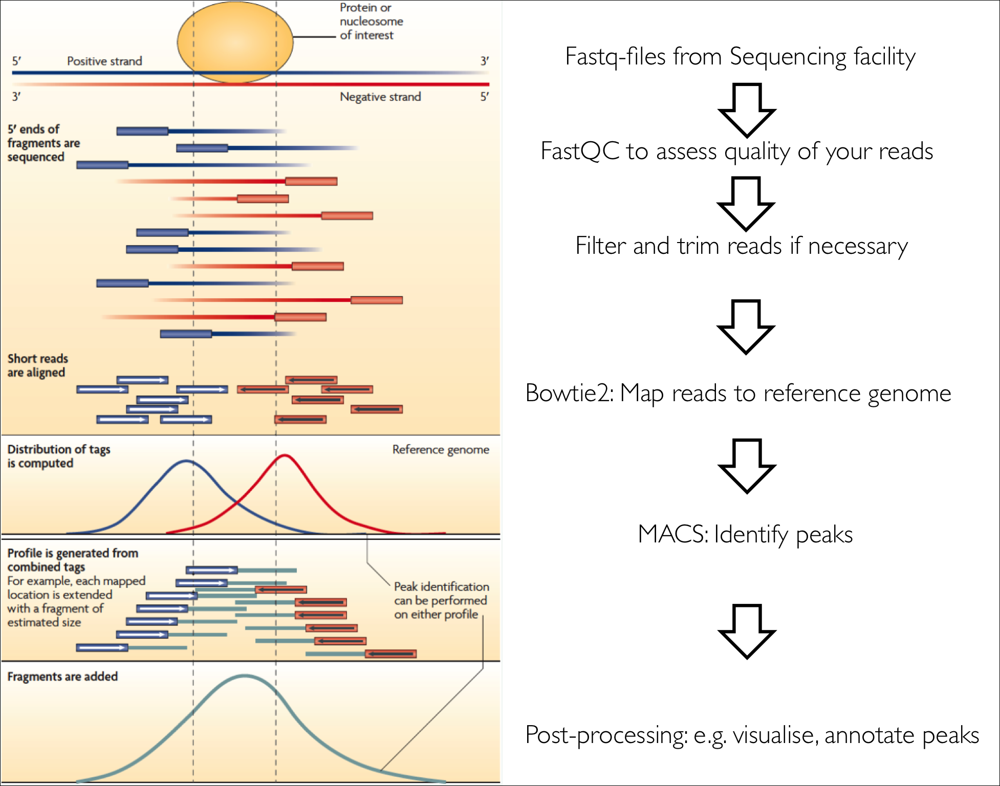
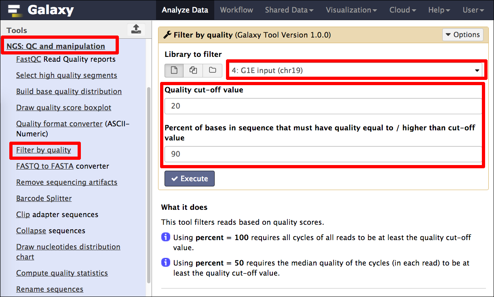

# An introduction to ChIP-seq analysis with Galaxy
## 1.0 Preface
In this brief tutorial we will learn how to use the excellent tool [Galaxy](http://galaxyproject.org/) ([http://galaxyproject.org/](http://galaxyproject.org/)) to analyse data from a chromatin immunoprecipitation followed by sequencing (ChIP-seq) experiment. It is part of a series of introductory tutorials that can be found at [http://sschmeier.github.io/bioinf-workshop/](http://sschmeier.github.io/bioinf-workshop/).

A PDF-version of this tutorial can be downloaded [here](doc/Galaxy-ChIPseq_sschmeier.pdf) or at [http://sschmeier.github.io/bioinf-workshop/galaxy-intro/doc/Galaxy-ChIPseq_sschmeier.pdf](http://sschmeier.github.io/bioinf-workshop/galaxy-intro/doc/Galaxy-ChIPseq_sschmeier.pdf)

An accompanying lecture for this tutorial is available at [figshare](http://dx.doi.org/10.6084/m9.figshare.) ([http://dx.doi.org/10.6084/m9.figshare.](http://dx.doi.org/10.6084/m9.figshare.)).

##1.1 Overview
In this brief tutorial we will learn how to use the excellent tool [Galaxy](http://galaxyproject.org/) to analyse ChIP-seq data. If you are new to [Galaxy](http://galaxyproject.org/), you might want to start with the [Galaxy introductory tutorial](http://sschmeier.github.io/bioinf-workshop/#!galaxy-intro/) ([http://sschmeier.github.io/bioinf-workshop/#!galaxy-intro/](http://sschmeier.github.io/bioinf-workshop/#!galaxy-intro/)).

## 1.2 The task at hand

The overall purpose in this tutorial is to:

  - Understand better the [Galaxy](http://galaxyproject.org/) system.
  - Understand how to get your data of interest into the system.
  - Understand how to quality control your sequencing data.
  - Understand how to map sequence reads to a reference genome.
  - Understand how to call ChIP-peaks based on the mapped reads.
  - Understand how to visualise your peaks.
  - Understand how to gather additional information about you data.

In order to develop an understanding of the points above, you will run through the workflow to analyse ChIP-seq data (see *Figure 1*):

*Figure 1: Workflow of this exercise (from [Hawkins2010]).*

**The individual tasks are:**

1. Load the dataset under 1.5.
2. Quality assess the reads.
3. Map the reads to the genome using Bowtie2.
4. Call peaks using MACS.
5. Visualise the peaks in IGV.
6. Run GREAT with the peak regions to find enriched annotations.
7. Prepare peak data and use MEME to find TFBS motifs.
8. Extract genes that have peaks in their upstream regions and run a GO-term analysis with the genes.

## 1.3 Log into Galaxy
First, go to [https://usegalaxy.org/](https://usegalaxy.org/) and log into your Galaxy account (see *Figure 2* and *Figure 3*).

*Figure 2: Log into your Galaxy account.*

*Figure 3: Log into your Galaxy account with your credentials.*

## 1.4 Create a new history
Create a new history (see *Figure 4*) and rename it to something useful (see *Figure 5*).

*Figure 4: Log into your Galaxy account.*

*Figure 5: Log into your Galaxy account with your credentials.*

## 1.5 Loading the data
We are going to use some *Shared Data* from the Galaxy Demonstration dataset.

1. Click on the *Shared Data* tab (see *Figure 6*).
2. Search for the *Demonstration Datasets*. (see *Figure 7*)

*Figure 6: Load shared data tab.*

*Figure 7: Look for the Demonstration Datasets.*

Load the following 4 files: G1E CTCF, G1E_ER4 CTCF, G1E ER4 input, G1E input (see *Figure 8*).

*Figure 8: Load the datasets.*

Once the files are loaded we can switch back to the analysis window by clicking *Analyze Data* tab (see *Figure 9*). We should find four datasets in the history panel (see *Figure 10*).

*Figure 9: Load the datasets.*

*Figure 10: Loaded data in history panel*

Alternatively, you can download the data [chipdata.zip](data/chipdata.zip) or (~40MB) from [http://sschmeier.github.io/bioinf-workshop/galaxy-chipseq/data/chipdata.zip](http://sschmeier.github.io/bioinf-workshop/galaxy-chipseq/data/chipdata.zip), unzip it and upload the files to the Galaxy history.

Hint! Should you need to refresh how to upload data to Galaxy, have a look at the [Galaxy introductory tutorial](http://sschmeier.github.io/bioinf-workshop/#!galaxy-intro/) ([http://sschmeier.github.io/bioinf-workshop/#!galaxy-intro/](http://sschmeier.github.io/bioinf-workshop/#!galaxy-intro/))).

## 1.6 Investigate the data
The four files that we have now in our history are: G1E CTCF, G1E_ER4 CTCF, G1E ER4 input, G1E input. A closer look reveals that they are in fastq-sanger format (see *Figure 11* and *Figure 12*). 

*Figure 11: Information about the data.*

*Figure 12: The fastq-format.*

What we are looking at is data from the [G1E mouse cell-line from Gata1-null mouse embryonic stem cells](https://www.encodeproject.org/biosamples/ENCBS324ENC/). We are looking at two conditions, normal G1E cell-lines and G1E-ER4 cell-lines, where the effect of Gata1 deletion is restored. Under both conditions the TF [CTCF](http://www.ncbi.nlm.nih.gov/gene/13018) has been ChIP'ed and sequenced. The "input" samples denote samples where CTCF has not been ChIPed and are thus the controls. We are also only looking at a subset of the full dataset, only chr19.

**Thus, we can compare the CTCF occupancy between G1E and G1E-ER4 cell-lines.**

## 1.7 Quality assessment
Now we need to assess the quality of the reads in each sample and filter and quality trim the reads if necessary.

### 1.7.1 FastQC
First, we run FastQC on each sample to get a feel for the overall quality of the data (see *Figure 13*).

*Figure 13: FastQC.*

Have a look at the HTML result page. Depending on what the results are you might want to do some filtering and quality trimming.

**TODO: Run FastQC on all four files and investigate the quality. Note for each sample the nucleotide number where the quality markedly drops.**

### 1.7.2 Read filtering
Here, we want to get rid of all reads that are of low quality. This strongly depends on your definition for "low quality". In the figure below the default values are used (see *Figure 14*). The *Quality cut-off* value is 20 and 90% of all nucleotides of the read need to be equal or above this cut-off value to be accepted. 

*Figure 14: Filtering reads of bad quality.*

Furthermore, I edited the dataset name (`1`) to keep track the kind of data (see *Figure 15*). The original name I copied into the notes field (`2`), however it is not strictly necessary as the information from which dataset this one was derived is still available when clicking the info button (see *Figure 16*). Finally, I renamed the dataset to something useful (`3`, see *Figure 15*).

*Figure 15: Rename the dataset to keep track.*

*Figure 16: Detailed information about a dataset can be gathered by clicking the info button.*

**TODO: Run the filtering on all four files and note how many reads got excluded for each sample (see the next section on how to speed this process up by re-running analyses).**

---

#### Re-running an analysis
Click on the re-run button of the analysis (`1`) you woud like to re-run (see *Figure 17*). The parameter window pops up with all the original parameters used. Now you can select a different dataset (`2`) and run the original analysis with the same parameters (see *Figure 17*).

*Figure 17: Re-run button to re-run the same analysis.*

---

### 1.7.3 Quality trimming
Finally, we can use a quality trimmer to get rid of bad starts and ends of reads (see *Figure 19*). To do so, select the *FASTQ Quality Trimmer* (`1`). Choose the **filtered** dataset from the step before (`2`). In *Figure 19* I use a simple window size of 1 (`3`) and a quality score of 20 (`4`) to just trim of the ends on both sides.

*Figure 19: Filtering reads of bad quality.*

**TODO: Run the quality trimmer on all *filtered* datasets and rename the sets to something meaningful.**

## 1.8 Mapping reads
By know we should have 4 sets of filtered and trimmed reads with a meaningful name (see *Figure 19*). These form the basis for the subsequent analyses. Now we are going to map the reads to the reference genome.

*Figure 19: The datasets for mapping.*

### 1.8.1 Bowtie2
We can now map the trimmed data to the reference genome using Bowtie2. Select Bowtie2 in the tools panel under section *NGS: Mapping* (`1`, see *Figure 19*). We select the *trimmed* dataset we want to map (`2`) and select an appropriate reference genome (`3`).

*Figure 19: Bowtie2.*

Using an inbuilt index choose the same genome built as your data is (here we are looking at mouse mm9 data). Choose the canonical index, **mm9 Canonical**.

From the Galaxy Bowtie tool description:
> A Note on Built-in Reference Genomes
>
>The default variant for all genomes is "Full", defined as all primary chromosomes (or scaffolds/contigs) including mitochondrial plus associated unmapped, plasmid, and other segments. When only one version of a genome is available in this tool, it represents the default "Full" variant. Some genomes will have more than one variant available. The "Canonical Male" or sometimes simply "Canonical" variant contains the primary chromosomes for a genome. For example a human "Canonical" variant contains chr1-chr22, chrX, chrY, and chrM. The "Canonical Female" variant contains the primary chromosomes excluding chrY.

Finally, we just use the default parameters of Bowtie2 (`4`) and execute the analysis (see *Figure 19*).

We can not look at the resulting data in detail, as the output is in a format called *bam* which is a binary version of the Sequence Alignment/Map (SAM) format (see [http://genome.ucsc.edu/goldenpath/help/bam.html](http://genome.ucsc.edu/goldenpath/help/bam.html) and [http://samtools.sourceforge.net/](http://samtools.sourceforge.net/) for an explanation). However, by clicking the dataset-name, we get more detailed information about the mapping (see *Figure 20*)

*Figure 20: Bowtie2 mapping information.*

**TODO: Run Bowtie2 on each of four trimmed datasets. Note for each sample the number of reads that could be aligned exactly once to the genome and the overall alignment percentage.**

## 2.3 References

Hawkins RD, Hon GC & Ren B. **Next-generation genomics: an integrative approach.** *[Nature Reviews Genetics. 2010; 11, 476-486] [Hawkins2010]*

[Hawkins2010]: http://www.nature.com/nrg/journal/v11/n7/full/nrg2795.html "Hawkins RD, Hon GC & Ren B. Next-generation genomics: an integrative approach. Nature Reviews Genetics. 2010; 11, 476-486"

## 2.4 Web links

This tutorial: [http://sschmeier.github.io/bioinf-workshop/galaxy-chipseq/](http://sschmeier.github.io/bioinf-workshop/galaxy-CHIPSEQ/)

