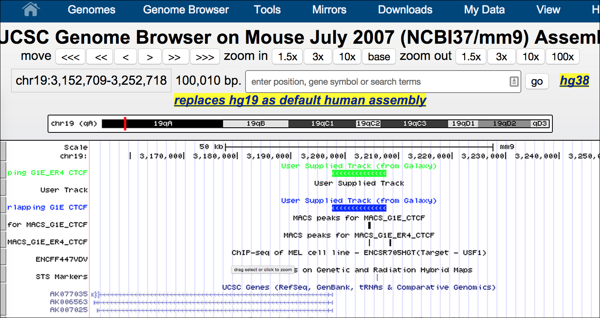
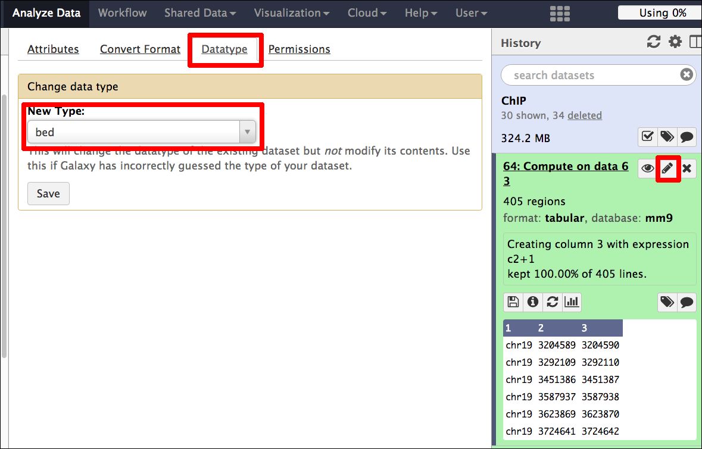

# An introduction to ChIP-seq analysis with Galaxy
## 1.0 Preface
In this brief tutorial we will learn how to use the excellent tool [Galaxy](http://galaxyproject.org/) ([http://galaxyproject.org/](http://galaxyproject.org/)) to analyse data from a chromatin immunoprecipitation followed by sequencing (ChIP-seq) experiment. It is part of a series of introductory tutorials that can be found at [http://sschmeier.github.io/bioinf-workshop/](http://sschmeier.github.io/bioinf-workshop/).

A PDF-version of this tutorial can be downloaded [here](doc/Galaxy-ChIPseq-Introduction_sschmeier.pdf) or at [http://sschmeier.github.io/bioinf-workshop/galaxy-chipseq/doc/Galaxy-ChIPseq-Introduction_sschmeier.pdf](http://sschmeier.github.io/bioinf-workshop/galaxy-chipseq/doc/Galaxy-ChIPseq-Introduction_sschmeier.pdf)

Two accompanying lectures for this tutorial are available:

  1. [ChIP-seq introduction](http://dx.doi.org/10.6084/m9.figshare.1545468) ([http://dx.doi.org/10.6084/m9.figshare.1545468](http://dx.doi.org/10.6084/m9.figshare.1545468)).
  2. [ChIP-seq data processing](http://dx.doi.org/10.6084/m9.figshare.1554130) ([http://dx.doi.org/10.6084/m9.figshare.1554130](http://dx.doi.org/10.6084/m9.figshare.1554130)).

##1.1 Overview
In this brief tutorial we will learn how to use the excellent tool [Galaxy](http://galaxyproject.org/) to analyse ChIP-seq data. If you are new to [Galaxy](http://galaxyproject.org/), you might want to start with the [Galaxy introductory tutorial](http://sschmeier.github.io/bioinf-workshop/#!galaxy-intro/) ([http://sschmeier.github.io/bioinf-workshop/#!galaxy-intro/](http://sschmeier.github.io/bioinf-workshop/#!galaxy-intro/)).

## 1.2 The task at hand

The overall purpose in this tutorial is to:

  - Understand better the [Galaxy](http://galaxyproject.org/) system ([1.3-1.4](#1.3_Log_into_Galaxy)).
  - Understand how to get your data of interest into the system ([1.5](#1.5_Loading_the_data)).
  - Understand how to quality control your sequencing data ([1.7](#1.7_Quality_assessment)).
  - Understand how to map sequence reads to a reference genome  ([1.8](#1.8_Mapping_reads)).
  - Understand how to call ChIP-peaks based on the mapped reads  ([1.9](#1.9_Peak_calling)).
  - Understand how to gather additional information about you data ([2.0](#2.0_Post-processing)).

In order to develop an understanding of the points above, you will run through the workflow to analyse ChIP-seq data (see *Figure 1*):

*Figure 1: ChIP-workflow (adjusted from [Park2009]).*

**The individual tasks are:**

1. Load the dataset.
2. Quality assess the reads.
3. Map the reads to the genome using Bowtie2.
4. Call peaks using MACS.
5. Run Enrichr with genes and GREAT with the peak regions to find enriched annotations.
6. Visualise the peaks in UCSC browser.
7. Prepare peak data and use MEME to find TFBS motifs.

## 1.3 Log into Galaxy
First, go to [https://usegalaxy.org/](https://usegalaxy.org/) and log into your Galaxy account (see *Figure 2* and *Figure 3*).

*Figure 2: Log into your Galaxy account.*

*Figure 3: Log into your Galaxy account with your credentials.*

## 1.4 Create a new history
Create a new history (see *Figure 4*) and rename it to something useful (see *Figure 5*).

*Figure 4: Log into your Galaxy account.*

*Figure 5: Log into your Galaxy account with your credentials.*

## 1.5 Loading the data
We are going to use some *Shared Data* from the Galaxy Demonstration dataset.

1. Click on the *Shared Data* tab (see *Figure 6*).
2. Search for the *Demonstration Datasets*. (see *Figure 7*)

*Figure 6: Load shared data tab.*

*Figure 7: Look for the Demonstration Datasets.*

Load the following 4 files: G1E CTCF, G1E_ER4 CTCF, G1E ER4 input, G1E input (see *Figure 8*).

*Figure 8: Load the datasets.*

Once the files are loaded we can switch back to the analysis window by clicking *Analyze Data* tab (see *Figure 9*). We should find four datasets in the history panel (see *Figure 10*).

*Figure 9: Load the datasets.*

*Figure 10: Loaded data in history panel*

Alternatively, you can download the data [chipdata.zip](data/chipdata.zip) or (~40MB) from [http://sschmeier.github.io/bioinf-workshop/galaxy-chipseq/data/chipdata.zip](http://sschmeier.github.io/bioinf-workshop/galaxy-chipseq/data/chipdata.zip), unzip it and upload the files to the Galaxy history.

Hint! Should you need to refresh how to upload data to Galaxy, have a look at the [Galaxy introductory tutorial](http://sschmeier.github.io/bioinf-workshop/#!galaxy-intro/) ([http://sschmeier.github.io/bioinf-workshop/#!galaxy-intro/](http://sschmeier.github.io/bioinf-workshop/#!galaxy-intro/))).

## 1.6 Investigate the data
The four files that we have now in our history are: G1E CTCF, G1E_ER4 CTCF, G1E ER4 input, G1E input. A closer look reveals that they are in fastq-sanger format (see *Figure 11* and *Figure 12*). 

*Figure 11: Information about the data.*

*Figure 12: The fastq-format.*

What we are looking at is data from the [G1E mouse cell-line from Gata1-null mouse embryonic stem cells](https://www.encodeproject.org/biosamples/ENCBS324ENC/). We are looking at two conditions, normal G1E cell-lines and G1E-ER4 cell-lines, where the effect of Gata1 deletion is restored. Under both conditions Ctcf has been ChIP'ed and sequenced. The "input" samples denote samples where the DNA was fragmented but before the immunoprecipitation against Ctcf and can thus be used as controls. We are also only looking at a subset of the full dataset, only chr19. **Thus, we can compare the CTCF occupancy between G1E and G1E-ER4 cell-lines.**

Note!
**TODO**:
  1. Find out what **Ctcf** is.
  2. Find out why studying **Gata1** in mouse embryonic stem cells is of interest?

Hint! You can use [NCBI gene](http://www.ncbi.nlm.nih.gov/gene/) or [wikigenes](https://www.wikigenes.org/) or even [wikipedia](https://en.wikipedia.org/) to find out about **Ctcf** and **Gata1**.

## 1.7 Quality assessment
Now we need to assess the quality of the reads in each sample and filter and quality trim the reads if necessary.

### 1.7.1 FastQC
First, we run FastQC on each sample to get a feel for the overall quality of the data (see *Figure 13*).

*Figure 13: FastQC.*

Have a look at the HTML result page. Depending on what the results are you might want to do some filtering and quality trimming.

Note!
**TODO**: Run FastQC on all four files and investigate the quality. Note for each sample the nucleotide number where the quality markedly drops.

### 1.7.2 Read filtering
Here, we want to get rid of all reads that are of low quality. This strongly depends on your definition for "low quality". In the figure below the default values are used (see *Figure 14*). The *Quality cut-off* value is 20 and 90% of all nucleotides of the read need to be equal or above this cut-off value to be accepted. 

*Figure 14: Filtering reads of bad quality.*

Furthermore, I edited the dataset name (`1`) to keep track the kind of data (see *Figure 15*). The original name I copied into the notes field (`2`), however it is not strictly necessary as the information from which dataset this one was derived is still available when clicking the info button (see *Figure 16*). Finally, I renamed the dataset to something useful (`3`, see *Figure 15*).

*Figure 15: Rename the dataset to keep track.*

*Figure 16: Detailed information about a dataset can be gathered by clicking the info button.*

Note!
**TODO**: Run the filtering on all four files and note how many reads got excluded for each sample (see the next section on how to speed this process up by re-running analyses).

---

#### Re-running an analysis
Click on the re-run button of the analysis (`1`) you woud like to re-run (see *Figure 17*). The parameter window pops up with all the original parameters used. Now you can select a different dataset (`2`) and run the original analysis with the same parameters (see *Figure 17*).

*Figure 17: Re-run button to re-run the same analysis.*

---

### 1.7.3 Quality trimming
Finally, we can use a quality trimmer to get rid of bad starts and ends of reads (see *Figure 19*). To do so, select the *FASTQ Quality Trimmer* (`1`). Choose the **filtered** dataset from the step before (`2`). In *Figure 19* I use a simple window size of 1 (`3`) and a quality score of 20 (`4`) to just trim of the ends on both sides.

*Figure 19: Filtering reads of bad quality.*

Note!
**TODO**: Run the quality trimmer on all *filtered* datasets and rename the sets to something meaningful.

## 1.8 Mapping reads
By know we should have 4 sets of filtered and trimmed reads with a meaningful name (see *Figure 19*). These form the basis for the subsequent analyses. Now we are going to map the reads to the reference genome.

*Figure 19: The datasets for mapping.*

### 1.8.1 Bowtie2
We can now map the trimmed data to the reference genome using Bowtie2. Select Bowtie2 in the tools panel under section *NGS: Mapping* (`1`, see *Figure 19*). We select the *trimmed* dataset we want to map (`2`) and select an appropriate reference genome (`3`).

*Figure 19: Bowtie2.*

Using an inbuilt index choose the same genome built as your data is (here we are looking at mouse mm9 data). Choose the canonical index, **mm9 Canonical**.

From the Galaxy Bowtie tool description:
> A Note on Built-in Reference Genomes
>
>The default variant for all genomes is "Full", defined as all primary chromosomes (or scaffolds/contigs) including mitochondrial plus associated unmapped, plasmid, and other segments. When only one version of a genome is available in this tool, it represents the default "Full" variant. Some genomes will have more than one variant available. The "Canonical Male" or sometimes simply "Canonical" variant contains the primary chromosomes for a genome. For example a human "Canonical" variant contains chr1-chr22, chrX, chrY, and chrM. The "Canonical Female" variant contains the primary chromosomes excluding chrY.

Finally, we just use the default parameters of Bowtie2 (`4`) and execute the analysis (see *Figure 19*).

We can not look at the resulting data in detail, as the output is in a format called *bam* which is a binary version of the Sequence Alignment/Map (SAM) format (see [http://genome.ucsc.edu/goldenpath/help/bam.html](http://genome.ucsc.edu/goldenpath/help/bam.html) and [http://samtools.sourceforge.net/](http://samtools.sourceforge.net/) for an explanation). However, by clicking the dataset-name, we get more detailed information about the mapping (see *Figure 20*)

*Figure 20: Bowtie2 mapping information.*

Note!
**TODO**: Run Bowtie2 on each of the four trimmed datasets. Note for each sample the number of reads that could be aligned exactly once to the genome and the overall alignment percentage.

## 1.9 Peak calling

Hint! You should have 4 bowtie2-generated bam-files in your history. If Galaxy did not run your bowtie2 tasks it could be that the queues are full. In this case, pelase download the Bowtie2 bam-files [here](data/bowtie2-results-bam.zip) or at [http://sschmeier.github.io/bioinf-workshop/galaxy-chipseq/data/bowtie2-results-bam.zip](http://sschmeier.github.io/bioinf-workshop/galaxy-chipseq/data/bowtie2-results-bam.zip). Unzip the files and upload all files to your Galaxy history and continue with 1.9.1.

### 1.9.1 MACS
Select the MACS tool in the **NGS Peak Calling** section:

1. Once you have the tool open (see *Figure 21*), give it a useful name.
2. We are dealing with single-end reads, so select this option.
3. We give it the Bowtie mapped file of the CTCF-ChIP'ed experiment and the "input" of the same cell-line as a control-file.
4. We need to adjust the genome size to that of mm9 Canonical which is 1.87e+9.
5. We also change the tag-size to 36.
6. Finally, we adjust the peak detection method to the "new" one.

*Figure 21: MACS peak calling.*

The results of the MACS run are two datasets (see *Figure 22*). One bed-file that contains the enriched regions and a html-file that provides more information about the MACS run, e.g. we can have a look at the estimated peak model (see *Figure 23*) or get more information about the peaks in the created xls-file (see *Figure 24*).

*Figure 22: MACS peak calling results.*

*Figure 23: MACS peak model.*

*Figure 24: MACS peak details.*

Note!
**TODO**:
1. Do the MACS peak calling for both cell-lines. Look at both peak models and note the distance and differences between the models.
3. Rename the peak-files to something meaningful and while you are doing it change the **score**-column to **5**.
3. What do you expect in terms of called peaks if you would run G1E-CTCF without a control (the "input"-file)?
4. RUN G1E-CTCF without the input control. Note the differences.

## 2.0 Post-processing
Now that we established the peaks, we can do several different analyses to gain information about the genes they regulate or differences in peak abundance as well as functional association.

## 2.1 Overlap peaks with promoter regions

### 2.1.1 Get genes
Let's upload some genes and extract promoter information for them. Please download the following file ([mm9_chr19_NCBIgenes.bed](data/mm9_chr19_NCBIgenes.bed) or from [http://sschmeier.github.io/bioinf-workshop/galaxy-chipseq/data/mm9_chr19_NCBIgenes.bed](http://sschmeier.github.io/bioinf-workshop/galaxy-chipseq/data/mm9_chr19_NCBIgenes.bed)) and upload to your Galaxy history (see *Figure 25*). the file contains 1428 gene regions in bed-format.

*Figure 25: Upload the gene bed-file.*

*Figure 26: The file is in bed-format.*

### 2.1.2 Get promoter
Get the promoter regions by using **Operate on Genomic Intervals** => **Get flanks**. Choose the upstream regions and 10,000 bases (see *Figure 27*). Rename the promoter-set to something meaningful.

*Figure 27: Get upstream flanking regions of the TSS of genes.*

### 2.1.3 Join
Now we are going to join (overlap) the peaks with the promoter regions by choosing the tool: **Operate on Genomic Intervals** => **Join** (see *Figure 28*). Again rename the resulting dataset to something useful.

*Figure 28: Overlap promoter and peaks with the join tool.*

Note!
**TODO**: Join the peak file for G1E CTCF and G1E_ER4 CTCF with the gene promoter regions. Note the numbers and differences in promoter numbers that overlap Ctcf peaks for both peak-files.

## 2.2 Enrichment analysis (genes) with Enrichr
Now lets take the genes with Ctcf in their promoter regions and do some functional annotation. To do this, we need the unique genes from the overlap of peaks and promteors form the step before. We will be using the tool: **Join, Subtract and Group** => **Group** to do this. **Group** aggregates data in a certain column. We will use it to aggregate column 4, the gene symbol column (see *Figure 29*). Copy the resulting genes symbol (see *Figure 30*).

*Figure 29: Aggregate the gene symbol column.*

*Figure 30: The aggregated gene symbols.*

Now, go to the online tool [Enrichr](http://amp.pharm.mssm.edu/Enrichr/) ([http://amp.pharm.mssm.edu/Enrichr/](http://amp.pharm.mssm.edu/Enrichr/)). [Enrichr](http://amp.pharm.mssm.edu/Enrichr/) provides a way to analyse mammalian gene lists to find enriched annotation terms to get a better understanding of the functions of the gene list under investigation. Go to **Analyze ** tab and paste your gene list into the field (see *Figure 31*). Click on the arrow.

*Figure 31: The Enrichr tool.*

On the result pages (see *Figure 32*) you will find several different categories (e.g. *Transcription*, *Pathways*, etc.) of with different databases where term-gene association information was extracted. *Figure 32* for example shows the enriched pathways from the [Reactome](http://www.reactome.org/) ([http://www.reactome.org/](http://www.reactome.org/)) database.

*Figure 32: The Enrichr results show enriched term associations to the input gene list.*

Note!
**TODO**:
1. Find and note the top 5 enriched [Gene Ontology](http://amigo.geneontology.org/) process terms for both the G1E and G1E_ER4 genes that have Ctcf in their promoters.
2. Now that you have unique gene lists for G1E and G1E_ER4, how many genes are in common, e.g. which genes in both cases have Ctcf in their promtoer region?

Hint! For point 2. you can use the  **Join, Subtract and Group** => **Compare two Datasets** tool.

## 2.3 Enrichment analysis (peaks) with GREAT
Here we are going to use another tool called [GREAT](http://bejerano.stanford.edu/great/public/html/) ([http://bejerano.stanford.edu/great/public/html/](http://bejerano.stanford.edu/great/public/html/)). Great as opposed to [Enrichr](http://amp.pharm.mssm.edu/Enrichr/) excepts bed-regions directly, thus we do not need to get the genes that overlap our peak regions. Take the results from MACS, cut out the first 4 columns with **Text Manipulation** => **Cut** (as GREAT does not except floats as scores and will produce errors), copy the regions and paste them into the [GREAT](http://bejerano.stanford.edu/great/public/html/) interface.

*Figure 33: The GREAT website.*

*Figure 34: GREAT result page.*

Note!
**TODO**: Run **GREAT** for both MACS result-files and note the top 5 **GO Biological processes**. Are they different to the ones from **Enrichr**?

## 2.4 Visualisation
Let us now create a visualisation track of the promoters that overlap G1E CTCF peaks and G1E_ER4 CTCF peaks. Use **Graph/Display Data** => **Build custom track** (see *Figure 33*). Also add the two MACS peak bed-files. Look at the track at UCSC (see *Figure 36* and *Figure 37*). 

*Figure 35: Building a custom UCSC track.*

*Figure 36: Visualising a Galaxy dataset/track.*

*Figure 37: Custom UCSC track at the UCSC genome browser website.*

## 2.5 Motif finding
Here we want to establish enriched sequence motifs in the peak regions to hypothesise on the acctual binding site of Ctcf. We are going to use [MEME-ChIP](http://meme.ebi.edu.au/meme/tools/meme-chip) ([http://meme.ebi.edu.au/meme/tools/meme-chip](http://meme.ebi.edu.au/meme/tools/meme-chip)) for this. However, [MEME-ChIP](http://meme.ebi.edu.au/meme/tools/meme-chip) expects fasta-sequence data as an input, not bed-files. So, we need to extract for our peak bed-files the actual sequence. Another restriction is, that [MEME-ChIP](http://meme.ebi.edu.au/meme/tools/meme-chip) expects regions of similar size, this is also not a given in the MACS results. The workflow for this analysis looks like this:

1. Find the center of each MACS peak region.
2. Get the flanking region +-250 bases (as the recommended region size for [MEME-ChIP](http://meme.ebi.edu.au/meme/tools/meme-chip) is 500bp).
3. Extract the fasta-sequence for the regions.
4. Download the fasta-file and upload to [MEME-ChIP](http://meme.ebi.edu.au/meme/tools/meme-chip).
5. Run [MEME-ChIP](http://meme.ebi.edu.au/meme/tools/meme-chip).

### 2.5.1 Find the peak center
We have the start and stop position in our bed-files, thus we can calculate the center point with **start + ((stop-start)/2)**. The tool we need is: **Text Manipulation** => **Compute** (see *Figure 38*). Make sure you round the results.

*Figure 38: Calculate center peak postion.*

Now we cut out the first column (chromosome) and last column (center) with **Text Manipulation** => **Cut** (see *Figure 39*).

*Figure 39: Cut columns.*

We add another column to the result that will reppresent the stop-postion with **Text Manipulation** => **Compute**. Make this **c2 + 1** (see *Figure *).

*Figure 40: Compute the stop-position.*

Now, the resulting data is in *tabular* format (see *Figure 41*) and we need to change it first to *bed-format* (see *Figure 42*).

 
*Figure 41: Center peaks.*

 
*Figure 42: Change the data-format to bed.*

### 2.5.2 Get flanking regions
Use **Operate on Genomic Intervals** => **Get flanks**. Extend **both** sides of the start position by **500** bases (see *Figure 43*).

 
*Figure 43: Get flanking regions.*

### 2.5.3 Extract fasta-sequence
Use **Fetch Sequences** => **Extract Genomic DNA** to extract for the regions the genomic DNA (see *Figure 44*).

 
*Figure 44: Extract DNA for regions.*

 
*Figure 45: Region in fasta-format.*

### 2.5.4 Run MEME-ChIP
Go to [MEME-ChIP](http://meme.ebi.edu.au/meme/tools/meme-chip) ([http://meme.ebi.edu.au/meme/tools/meme-chip](http://meme.ebi.edu.au/meme/tools/meme-chip)) and copy the fasta-sequences into the field and run the application (see *Figure 45*). This may result in enriched sequence motifs that were found in the uploaded sequences (see *Figure 46*). 

 
*Figure 45: MEME-ChIP interface.*

 
*Figure 46: MEME-ChIP results.*

Note!
**TODO**: Note the enriched motif for the G1E CTCF  and G1E_ER4 peak regions. Are there any differences?

## 2.6 References

Hawkins RD, Hon GC & Ren B. **Next-generation genomics: an integrative approach.** *[Nature Reviews Genetics. 2010; 11, 476-486] [Hawkins2010]*

Park PJ. **ChIP–seq: advantages and challenges of a maturing technology.** *[Nature Reviews Genetics. 2009; 10, 669-680] [Park2009]*

[Hawkins2010]: http://www.nature.com/nrg/journal/v11/n7/full/nrg2795.html "Hawkins RD, Hon GC & Ren B. Next-generation genomics: an integrative approach. Nature Reviews Genetics. 2010; 11, 476-486"

[Park2009]: http://www.nature.com/nrg/journal/v10/n10/abs/nrg2641.html "Park PJ. ChIP–seq: advantages and challenges of a maturing technology. Nature Reviews Genetics. 2009; 10, 669-680"

## 2.7 Web links

Galaxy: [https://usegalaxy.org](https://usegalaxy.org)

Enrichr: [http://amp.pharm.mssm.edu/Enrichr/](http://amp.pharm.mssm.edu/Enrichr/)

GREAT: [http://bejerano.stanford.edu/great/public/html/](http://bejerano.stanford.edu/great/public/html/)

Gene Ontology: [http://amigo.geneontology.org/](http://amigo.geneontology.org/)

MEME-ChIP: [http://meme.ebi.edu.au/meme/tools/meme-chip](http://meme.ebi.edu.au/meme/tools/meme-chip)

This tutorial: [http://sschmeier.github.io/bioinf-workshop/galaxy-chipseq/](http://sschmeier.github.io/bioinf-workshop/galaxy-chipseq/)

