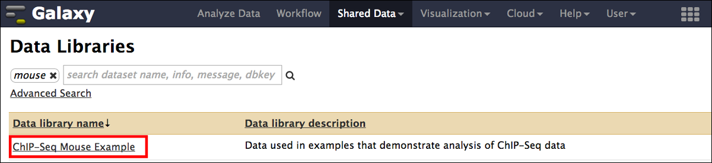

# Galaxy introduction 1

##1.1 Overview
In this brief tutorial we will learn how to use the excellent tool [Galaxy](http://galaxyproject.org/) to analyze biological data. We will see how it  [Galaxy](http://galaxyproject.org/) allows you to make use of a number of tools in a simple to use graphical interface (more on that in a moment). A user is thus not required to use any of the tools on the command-line (even though many of the integrated tools were developed for the command-line in the first place) but can fully use and control the integrated tools with the mouse pointer. In addition, it also allows developers of tools to easily integrate them into a graphical user interface system that is already known to many scientists and thus make the tools available for the research community. 

Another big advantage of [Galaxy](http://galaxyproject.org/) is that every step of the analysis is monitored and accessibly via a history. This makes reproducible research not only a possibility but also easy to facilitate. Steps from the history can be packaged into work-flows, which can be reused with  different data or shared with other scientists. 
[Galaxy](http://galaxyproject.org/) enjoys a large and growing user and developer base, which is evident by its own yearly [conference](http://gcc2015.tsl.ac.uk/) and participation in [Google Summer of Code](https://wiki.galaxyproject.org/Develop/GSOC/2015). It is relatively easy to find help should one need it, e.g. through their [mailing list](http://wiki.galaxyproject.org/MailingLists) or [wiki](http://wiki.galaxyproject.org/). Also, many commercial companies that provide next-generation sequencing services, provide Galaxy instances to analyze your data (e.g.  we at [New Zealand Genomics Limited](http://nzgenomics.co.nz) have a full fledged installation on our infrastructure ready for scientist to be used).

### 1.1.1 Important links
  * [__Wiki__](http://wiki.galaxyproject.org/)
  * [__Mailing lists__](http://wiki.galaxyproject.org/MailingLists)
  * [__Other learning material__](https://wiki.galaxyproject.org/Learn)

----------------------------------------------------------------
## 1.2 How to get access to Galaxy
There many option available to either give [Galaxy](http://galaxyproject.org/) a test run or do a full analysis with it. There is a ever growing list of public servers [available](https://wiki.galaxyproject.org/PublicGalaxyServers), some of which might have certain restrictions, e.g. maximum data-file size, etc. The standard server is accessible at: [https://usegalaxy.org/](https://usegalaxy.org/)

You can start your own [Galaxy](http://galaxyproject.org/) instances on [Cloud](https://wiki.galaxyproject.org/Cloud) infrastructure, e.g. [Amazon Cloud Services](http://aws.amazon.com/), should you have bigger analysis needs that you want to perform in the cloud.

You can [download](https://wiki.galaxyproject.org/Admin/GetGalaxy) and install [Galaxy](http://galaxyproject.org/) on you own machine or server, even integrating a computer cluster on the back-end.

You can install [BioLinux](http://environmentalomics.org/bio-linux/) on you own machine or run [BioLinux](http://environmentalomics.org/bio-linux/) as a virtual machine and you are set as well, as [Galaxy](http://galaxyproject.org/) comes pre-installed on [BioLinux 8](http://environmentalomics.org/bio-linux/).

----------------------------------------------------------------
## 1.3 The user interface
### 1.3.1 Basics

Hint! Click on the Galaxy screenshots to get a bigger version!

There are 3 areas of interest for now:

  1. The links to the tools that the Galaxy installation contains (this can very from Galaxy instance to instance).
  2. The working area, where we can change parameters of the tools that we want to use for some of our data.
  3. The history panel that contains all the data and steps we performed on the data.

### 1.3.2 User accounts
If you plan to use the public available Galaxy instance at [https://usegalaxy.org/](https://usegalaxy.org/), it is a good idea to create a user account. This is relatively straight forward, just click on `User` in the top panel and then `Register` (`1`). This will allow you, amongst other things, to save histories, but more on this in later ([2.7](#2.7_A_word_on_the_history)).

----------------------------------------------------------------
## 1.4 A word on tools
The tools that you find in the tools area of the Galaxy instance are nothing else than programs that were originally written for the command-line. As lon as you have/write a program that excepts a input-file and out-put-file as command-line arguments, it is quite easy to [integrate a tool](https://wiki.galaxyproject.org/Admin/Tools/AddToolTutorial) into an local Galaxy installation.

Attention! The tools that you find in your Galaxy instance might differ depending on where you access the particular Galaxy installation/instance., e.g. you might find a different toolset at the standard online Galaxy instance at [https://usegalaxy.org/](https://usegalaxy.org/), than on your local installation.

----------------------------------------------------------------
## 2.1 A simple example

The purpose in this example is not to find anything of biological relevance but rather to:

  1. Understand the Galaxy system 
  2. Understand how to get your data of interest into the system
  3. Understand how to do simple data manipulation tasks
  4. Understand how the Galaxy History system works
  5. Understand how to set up a workflow and run your data through it

I order to develop the understanding of the five points above, we are going through a simple example:

**_"We want to find the mouse chromosome X genes that have single nucleotide polymorphism in their upstream regions"_**

**The tasks required to find those mutations are:**

  1. Get single nucleotide polymorphism (SNP) data for chromosome X
  2. Get all gene locations on chromosome X
  3. Get upstream regions of the genes 
  4. Overlap the SNPs with the genic upstream regions
  8. Visualise results in a genome browser

----------------------------------------------------------------
## 2.2 Loading your own data
Download the following file to your computer: [mm9_chrX_SNP128_set.bed](data/mm9_chrX_SNP128_set.bed). The file is in [bed-format](http://genome.ucsc.edu/FAQ/FAQformat.html#format1), a simple tab-separated format containing 6 columns: **chromosome, start, stop, name, score, strand**.

Hint! Bed-format files can have more or less columns. However, the first three columns are  the bare minimum.

  1. On you Galaxy window go to the upper left in the tools area and click on `Get Data`. A subsection of `Get Data` will open and show available option for you to get data into the Galaxy system.
  2. Choose `Upload File from your computer`. 

 1. An additional window should open that allows you to select the your file.
 2. Here you can specify the species, given that we are looking at mouse data from mm9 set it to the same.

Once you hit the `Start` button, your data/analysis will be uploaded. In your history your data goes through three stages indicated by three different colors:

  1. Grey: Scheduled for uploading/running
  2. Yellow: Currently running
  3. Green: Dataset/analysis is ready

  1. Click on the filename and you get some information about the data.
  2. Here you will see information like how many regions (lines) are in the file, the format and genome
  3. Here you can download the data, get even more information about the data and run the job again (here it would reload the data)

Within the history panel and your data set there are several buttons of importance. The first one which looks like an eye will display you data in the working area.

  1. The second button will allow you to edit your data
  2. You can change the file-name
  3. Change the assignment of column numbers to particular properties
  4. and finally save your changes.

The last button can delete your data/analysis again from the history panel.

----------------------------------------------------------------
## 2.3 Loading data from web resources
Now we are focusing on getting some data from the [UCSC table browser](https://genome.ucsc.edu/cgi-bin/hgTables). Many people UCSC were quite busy integrating lots of data and there is plenty of data available especially for mammalian model systems.

  1. On you Galaxy window go to the upper left in the tools area and click on `Get Data`. A subsection of `Get Data` will open and show available option for you to get data into the Galaxy system.
  2. Click on `UCSC Main table browser`. This will open the  [UCSC table browser](https://genome.ucsc.edu/cgi-bin/hgTables) in your Galaxy working area.
  3. Here you can choose the genome that you want the data from, we will choose mm9
  4. Here you can choose the kind of data that you which to download from the particular genome, we will choose here the `Genes and Gene Prediction group` and the `UCSC Genes` as well as the `knownGene` table. The `describe table schema` button will get you to aanother webpage that describes the data within the `knownGene` table. Feel free to explore.
  5. Here you can chose if you which to download data from the whole genome or a subportion of it. We will choose here only data from **_chrX_** type this in the field and hit `lookup`
 button which will complete the start and stop coordinates of the genome.
  6. Here we can specify the output-format. It is important here to make sure that the `Send output to Galaxy` choice is selected . Also, we want BED-format again.
  7. After we are finsihed we can hit the `get output` button, after which our requested data will be loaded into the Galaxy interface.
  

Finally, your data should appear in the right hand side history panel.

----------------------------------------------------------------
## 2.4 Loading shared data
Another way of loading data into your history panel is by loading data that was shared with you through Galaxy. On the upper panel click on `Shared Data` and then on `Data Libraries`.

Here you will find a search field to search for available datasets. Search for mouse becasue currently we are working with mouse data.

Choose the **ChIP-Seq Mouse Example** dataset from the ENCODE project. This is data of of chromatin immunoprecipitation followed by sequencing to find regions in the genome where transcription factors bind.

Here you see an overview of the datasets available. You can choose the dataset, select `Import to current history`, and hit `Go`.

Once the data is loaded in your history Galaxy will inform you. You can get back to your working area by clicking on `Analyze Data`.

----------------------------------------------------------------
## 2.5 Working with data and genome interval files
The aim here is to get understand how Galaxy can help you to prepare your data to be able to analyze it further. We will perform some easy tasks like removing redundant information, renaming new datasets, sub-selecting regions of interest, extending our genomic regions to look at promoters upstream of genes, finding the SNPs from our set that overlap the promtoer regions.

----------------------------------------------------------------
### 2.5.1 Renaming files
You should aim at nameing your files ina manner that they are easy recognizable. This is especially important once we manipulate them and create new files. You should make it a habit of renaming a file after it was created to keep track of what they are.

  1. Click on the `edit icon` of the file you wish to change.
  2. Type a new filename in the `Name` field.
  3. Click on the `Safe` button

Attention! I also renamed the data `Mouse ChIP-Seq example Control Data, chr19, mm9` to --> `mm9_ChIP_chr19_control` and the data `mm9_chrX_SNP128_set.bed` to -->`mm9_chrX_SNP128`.

Attention! The numbering of the datasets here might be different from yours depending on how many datasets you have been working on before. The image above shows `24: mm9_knownGene_chrX`, however, this may vary for you (and might vary in what follows here as I might have done this tutorial in multiple sessions.). This is one reason why it is a good idea to rename the dataset.

----------------------------------------------------------------
### 2.5.2 Removing unwanted information
Our gene BED-file that we retrieved from [UCSC table browser](#2.3_Loading_data_from_web_resources) is in BED 12 format, e.g. it contains 12 columns, but only the first 6 are necessary for our purposes. Thus, we aim at removing the extra columns to make the file more readable. Let's do this by

  1. Clicking on the `Text manipulation` tools section
  2. Selecting the `Cut` tool.
  3. Insert the columns you want to retain. We want the first 6 columns.
  4. Choose the right file to do the manipulation on
  5. Execute the tool

You should see a new file in the history. Here it is being scheduled for execution and should be green once the job is finished. Please rename the resulting dataset to --> `mm9_knownGene_chrX_short`.

----------------------------------------------------------------
### 2.5.3 Creating flanking regions
Because we are interested to look in the promoter regions of our genes we need to extract those. We here define the promoter as upstream regions from the transcription start site.

  1. Find the `Operate on Genomic Intervals" sections`
  2. Select the `Get flanks` tool
  3. Choose the right dataset: `mm9_knownGene_chrX_short`
  4. The region we are interested in is `Around Start`
  5. We want the `Upstream` region
  6. We want `5000` bases upstream
  7. `Execute`

Attention! I renamed the resulting dataset --> `mm9_chrX_promoter`

----------------------------------------------------------------
### 2.5.4 Filter data
Filtering data can be done in many different ways, however, here we use the `filter` tool.

  1. Find the `Filter and Sort` tool section
  2. Select the `Filter` tool
  3. Select our promoter dataset: `mm9_chrX_promoter`
  4. We only want promoter within the first `8000000` bases, the start positionof genes is specified in the second column (`c2`)
  5. `Execute`

Attention! I renamed the resulting dataset --> `mm9_chrX_promoter_8000000`

Hint! If you click on the dataset name it will also tell  you how many lines where extracted from the original dataset.

----------------------------------------------------------------
### 2.5.5 Joining/intersecting data sets
Lets find those mutations that overlap our promoter subset.

  1. Find the `Operate on genomic Intervals` tool section
  2. Select the `Join` tool
  3. Select our SNP data `mm9_chrX_SNP128` and the promoter dataset `mm9_chrX_promoter_8000000`
  4. `INNER JOIN`
  5. `Execute`

Attention! I renamed the resulting dataset --> `SNPs_at_promoter`

If you temporarily close the history tab we can have a closer look at the resulting dataset. 

We see that we have 2,218 SNPs overlapping promoter regions in the genes in the first 8,000,000 base pairs. The `Join` tool put the overlapping elements right next to each other.

Note! that for one particular promoter we can have several SNPs (`1`).

----------------------------------------------------------------
## 2.6 Visualising data sets
Now that we basically have what we are looking for we want to visualise our found SNPs and the promoter that have mutations in an intuitive manner. Here, Genome Bowsers come in that are helpful in getting an overview. In this section we prepare the data we would like to visualise and prepare a custom track for the [UCSC Genome Browser](https://genome.ucsc.edu/cgi-bin/hgTracks). First, what data do we want to visualise:

  1. All SNPs
  2. The SNPs that overlap our promoter regions
  3. The promoter regions

To create a new track that we can visualise in USCS, do the following:

  1. Find the `Graph/Display Data` tool section
  2. Select the `Build custom track` tool
  3. Click on insert track and select our promoter data `mm9_chrX_promtoer_8000000`.
  4. Give it a unique name 
  5. Insert more tracks for data like `SNPs_at_promoter` and `mm9_chrX_SNP128`.
  6. `Execute`

Attention! Make sure to use **unique names** for each track, because if you use the same name twice the last track overwrites the one from before.

Once you hit the `Execute` button you should have a new track created which is visible in the history panel (`1`). Click on the name of that track and click `display at UCSC main` (`2`).

If you do so, a new window at the UCSC Genome browser will open. Put **chrX:3,237,911-3,249,163** in the search bar (`1`) and you will see a postion that shows what is going on. Right on top should be your three tracks located (`2`). You can scroll left and right, zoom in and out to get to other promoter regions. YOu can also change the resolution at which your features will be shown. Many other tracks from UCSC are also shown automatically and ad the bottom of the page you can chose to show or hide other tracks of interest.

----------------------------------------------------------------
## 2.7 A word on the history

You are able to create an account on the public Galaxy [web-server](https://usegalaxy.org/). Once done, you will be able to save histories and fetch you old histories back. In this manner you are also able to save whole work-flows but more on that later.

For now you can look at your saved histories by clicking the config button in the upper right.

You will see only one history the one we are currently working on. You can rename the history by clicking the name in the history panel or by doing a rename in the working area.

----------------------------------------------------------------
## 2.8 Workflows

----------------------------------------------------------------
### 2.8.1 Creating and editing workflows

----------------------------------------------------------------
### 2.8.2 Applying workflows to your data
