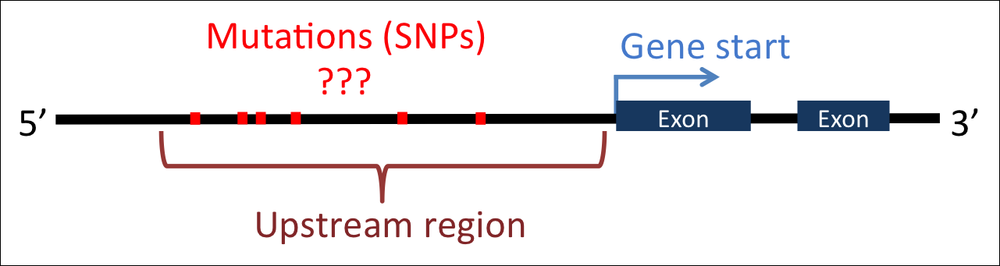
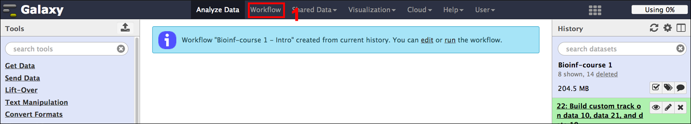
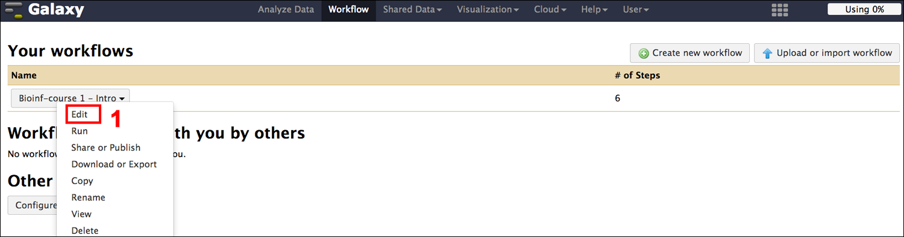
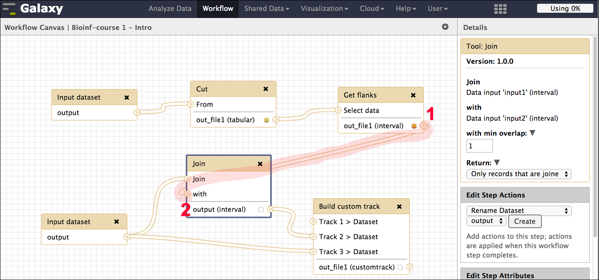
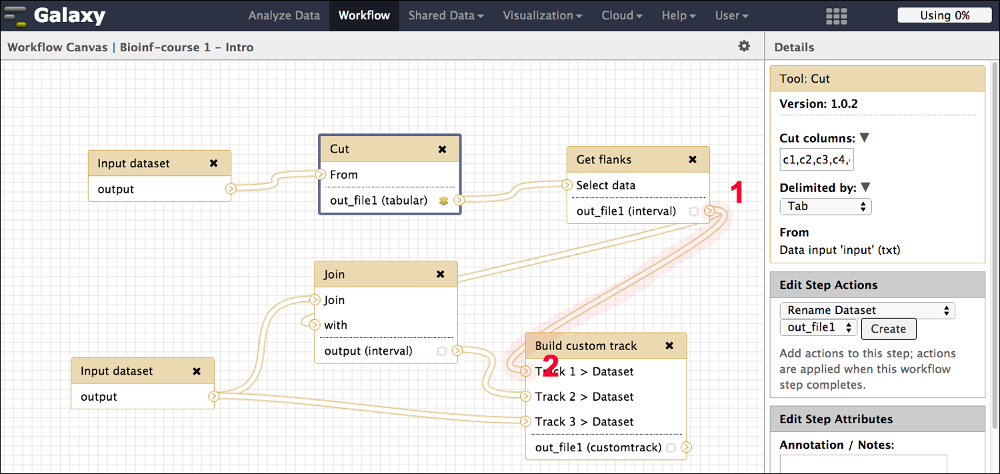
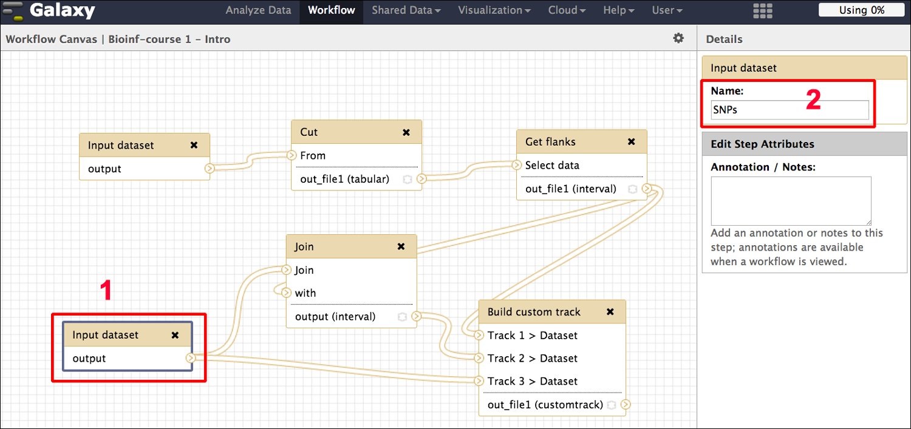
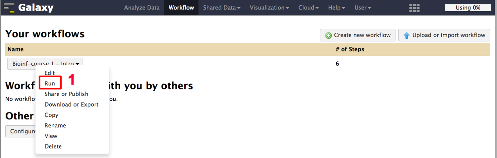

# Galaxy Introduction
## 1.0 Preface
In this brief tutorial we will learn how to use the excellent tool [Galaxy](http://galaxyproject.org/) ([http://galaxyproject.org/](http://galaxyproject.org/)) to analyze biological data. It is part of a series of introductory tutorials that can be found at [http://sschmeier.github.io/bioinf-workshop/](http://sschmeier.github.io/bioinf-workshop/).

A PDF-version of this tutorial can be downloaded [here](doc/GalaxyIntro_sschmeier.pdf) or at [http://sschmeier.github.io/bioinf-workshop/galaxy-intro/doc/GalaxyIntro_sschmeier.pdf](http://sschmeier.github.io/bioinf-workshop/galaxy-intro/doc/GalaxyIntro_sschmeier.pdf)

An accompanying lecture for this tutorial is available at [figshare]() ().

##1.1 Overview
In this brief tutorial we will learn how to use the excellent tool [Galaxy](http://galaxyproject.org/) to analyze biological data. We will see how it  [Galaxy](http://galaxyproject.org/) allows you to make use of a number of tools in a simple to use graphical interface (more on that in a moment). A user is thus not required to use any of the tools on the command-line (even though many of the integrated tools were developed for the command-line in the first place) but can fully use and control the integrated tools with the mouse pointer. In addition, it also allows developers of tools to easily integrate them into a graphical user interface system that is already known to many scientists and thus make the tools available for the research community.

Another big advantage of [Galaxy](http://galaxyproject.org/) is that every step of the analysis is monitored and accessibly via a history. This makes reproducible research not only a possibility but also easy to facilitate. Steps from the history can be packaged into work-flows, which can be reused with different data or shared with other scientists.

*Figure 1: Galaxy Community Conference 2015*

[Galaxy](http://galaxyproject.org/) enjoys a large and growing user and developer base, which is evident by its own yearly [conference](http://gcc2015.tsl.ac.uk/) (see *Figure 1*, [http://gcc2015.tsl.ac.uk/](http://gcc2015.tsl.ac.uk/)) and participation in [Google Summer of Code](https://wiki.galaxyproject.org/Develop/GSOC/2015). It is relatively easy to find help should one need it, e.g. through their [mailing list](http://wiki.galaxyproject.org/MailingLists) or [wiki](http://wiki.galaxyproject.org/) ([http://wiki.galaxyproject.org/](http://wiki.galaxyproject.org/)). Also, many commercial companies that provide next-generation sequencing services, provide Galaxy instances to analyze your data (e.g.  we at [New Zealand Genomics Limited](http://nzgenomics.co.nz) ([http://nzgenomics.co.nz](http://nzgenomics.co.nz)) have a full fledged installation on our infrastructure ready for scientist to be used).

## 1.2 How to get access to Galaxy
There many option available to either give [Galaxy](http://galaxyproject.org/) a test run or do a full analysis with it. There is a ever growing list of public servers [available](https://wiki.galaxyproject.org/PublicGalaxyServers), some of which might have certain restrictions, e.g. maximum data-file size, etc. The standard server is accessible at: [https://usegalaxy.org/](https://usegalaxy.org/)

You can start your own [Galaxy](http://galaxyproject.org/) instances on [Cloud](https://wiki.galaxyproject.org/Cloud) infrastructure, e.g. [Amazon Cloud Services](http://aws.amazon.com/), should you have bigger analysis needs that you want to perform in the cloud.

You can [download](https://wiki.galaxyproject.org/Admin/GetGalaxy) and install [Galaxy](http://galaxyproject.org/) on you own machine or server, even integrating a computer cluster on the back-end.

You can install [BioLinux](http://environmentalomics.org/bio-linux/) on you own machine or run [BioLinux](http://environmentalomics.org/bio-linux/) as a virtual machine and you are set as well, as [Galaxy](http://galaxyproject.org/) comes pre-installed on [BioLinux 8](http://environmentalomics.org/bio-linux/).

## 1.3 The user interface
### 1.3.1 Basics

*Figure 2: Galaxy overview.*

There are 3 areas of interest for now (see *Figure 3*):

  1. The links to the tools that the [Galaxy](http://galaxyproject.org/) installation contains (this can very from [Galaxy](http://galaxyproject.org/) instance to instance).
  2. The working area, where we can change parameters of the tools that we want to use for some of our data.
  3. The history panel that contains all the data and steps we performed on the data.

*Figure 3: Galaxy main window areas.*

### 1.3.2 User accounts
If you plan to use the public available [Galaxy](http://galaxyproject.org/) instance at [https://usegalaxy.org/](https://usegalaxy.org/), it is a good idea to create a user account. This is relatively straight forward, just click on **User** in the top panel (see *Figure 4*) and then **Register** (`1`). This will allow you, amongst other things, to save histories, but more on this in later ([2.1](#2.1_Another_word_on_the_history)).

*Figure 4: Galaxy user login.*

## 1.4 A word on tools
The tools that you find in the tools area of the [Galaxy](http://galaxyproject.org/) instance are nothing else than programs that were originally written for the command-line. As lon as you have/write a program that excepts a input-file and out-put-file as command-line arguments, it is quite easy to [integrate a tool](https://wiki.galaxyproject.org/Admin/Tools/AddToolTutorial) into an local [Galaxy](http://galaxyproject.org/) installation.

Attention! The tools that you find in your [Galaxy](http://galaxyproject.org/) instance might differ depending on where you access the particular [Galaxy](http://galaxyproject.org/) installation/instance., e.g. you might find a different toolset at the standard online [Galaxy](http://galaxyproject.org/) instance at [https://usegalaxy.org/](https://usegalaxy.org/), than on your local installation.

## 1.5 The task at hand

The overall purpose in this tutorial is to:

  - Understand the [Galaxy](http://galaxyproject.org/) system 
  - Understand how to get your data of interest into the system
  - Understand how to do simple data manipulation tasks
  - Understand how the [Galaxy](http://galaxyproject.org/) History system works
  - Understand how to set up a workflow and run your data through it (*advanced*)

In order to develop an understanding of the points above, you are required to solve the following problem (see *Figure 6*):

**_"Using Galaxy, find the mouse chromosome X genes that have single nucleotide polymorphisms in their upstream region"_**

*Figure 6: Are there any SNPs?*

**The individual steps required to find those mutations are:**

  1. Get single nucleotide polymorphism (SNP) data for chromosome X
  2. Get all gene locations on chromosome X
  3. Get upstream regions of the genes 
  4. Overlap the SNPs with the genic upstream regions
  8. Visualise results in a genome browser

**The deliverables are:**

  1. The list of genes that have SNPs in their upstream region.
  2. The list of SNPs that are located in the upstream regions.
  3. A screenshot of one of the genes with SNPs upstream (**other** than gene *ENSMUST00000105020* from *Figure 29*).

## 1.6 Loading your own data
Download the following file to your computer: [mm9_chrX_SNP128_set.bed](data/mm9_chrX_SNP128_set.bed) or at [http://sschmeier.github.io/bioinf-workshop/galaxy-intro/data/mm9_chrX_SNP128_set.bed](http://sschmeier.github.io/bioinf-workshop/galaxy-intro/data/mm9_chrX_SNP128_set.bed).

The file is in [bed-format](http://genome.ucsc.edu/FAQ/FAQformat.html#format1), a simple tab-separated format containing 6 columns: **chromosome, start, stop, name, score, strand**.

Hint! Bed-format files can have more or less columns. However, the first three columns are  the bare minimum.

  1. On you [Galaxy](http://galaxyproject.org/) window go to the upper left in the tools area and click on **Get Data**. A subsection of **Get Data** will open and show available option for you to get data into the [Galaxy](http://galaxyproject.org/) system (see *Figure 5*).
  2. Choose **Upload File from your computer**. 

*Figure 5: Get data tools.*

 1. An additional window should open that allows you to select the your file (see *Figure 7*).
 2. You can specify the species, given that we are looking at mouse data from mm9 set it to the same.

*Figure 7: Data upload interface.*

Once you hit the **Start** button, your data/analysis will be uploaded. In your history your data goes through three stages indicated by three different colours (see *Figure 8*):

  1. Grey: Scheduled for uploading/running 
  2. Yellow: Currently running
  3. Green: Dataset/analysis is ready

*Figure 8: The history panel: Different color codes.*

  1. Click on the filename and you get some information about the data (see *Figure 9*).
  2. Here you will see information like how many regions (lines) are in the file, the format and genome
  3. Here you can download the data, get even more information about the data and run the job again (here it would reload the data)

*Figure 9: The history panel: Investigating datasets.*

Within the history panel and your data set there are several buttons of importance. The first one which looks like an eye will display you data in the working area (see *Figure 10*).

*Figure 10: The history panel: The eye button.*

  1. The second button will allow you to edit your data (see *Figure 11*).
  2. You can change the file-name.
  3. Change the assignment of column numbers to particular properties.
  4. Save your changes.

*Figure 11: The history panel: Data editing interface.*

The last button can delete your data/analysis again from the history panel (see *Figure 12*).

*Figure 12: The history panel: The delete button.*

## 1.7 Loading data from the web 
Now we are focusing on getting some data from the [UCSC table browser](https://genome.ucsc.edu/cgi-bin/hgTables). Many people UCSC were quite busy integrating lots of data and there is plenty of data available especially for mammalian model systems.

  1. On you [Galaxy](http://galaxyproject.org/) window go to the upper left in the tools area and click on **Get Data** (see *Figure 13*). A subsection of **Get Data** will open and show available option for you to get data into the [Galaxy](http://galaxyproject.org/) system.
  2. Click on **UCSC Main table browser**. This will open the  [UCSC table browser](https://genome.ucsc.edu/cgi-bin/hgTables) in your [Galaxy](http://galaxyproject.org/) working area.
  3. Here you can choose the genome that you want the data from, we will choose mm9
  4. Here you can choose the kind of data that you which to download from the particular genome, we will choose here the **Genes and Gene Prediction group** and the **UCSC Genes** as well as the **knownGene** table. The **describe table schema** button will get you to aanother webpage that describes the data within the **knownGene** table. Feel free to explore.
  5. Here you can chose if you which to download data from the whole genome or a subportion of it. We will choose here only data from **_chrX_** type this in the field and hit **lookup**
 button which will complete the start and stop coordinates of the genome.
  6. Here we can specify the output-format. It is important here to make sure that the **Send output to Galaxy** choice is selected . Also, we want BED-format again.
  7. After we are finsihed we can hit the **get output** button, after which our requested data will be loaded into the [Galaxy](http://galaxyproject.org/) interface.
  

*Figure 13: Loading UCSC data into Galaxy.*

Finally, your data should appear in the right hand side history panel.

## 1.8 Loading shared data
Another way of loading data into your history panel is by loading data that was shared with you through [Galaxy](http://galaxyproject.org/). On the upper panel click on **Shared Data** and then on **Data Libraries** (see *Figure 14*).

*Figure 14: Loading shared data.*

Here you will find a search field to search for available datasets (see *Figure 15*). Search for mouse becasue currently we are working with mouse data.

*Figure 15: The shared data search bar.*

Choose the **ChIP-Seq Mouse Example** dataset from the ENCODE project. This is data of of chromatin immunoprecipitation followed by sequencing to find regions in the genome where transcription factors bind.

*Figure 16: Details about shared data.*

Here you see an overview of the datasets available (see *Figure 16*). You can choose the dataset, select **Import to current history**, and hit **Go** (see *Figure 17*).

*Figure 17: Selecting shared data for loading into Galaxy.*

Once the data is loaded in your history [Galaxy](http://galaxyproject.org/) will inform you (see *Figure 18*). You can get back to your working area by clicking on **Analyze Data**.

*Figure 18: Successful loaded shared data.*

You can get rid of the dataset again in your history as it will not be used anymore in theis

## 1.9 Working with data
The aim here is to get understand how [Galaxy](http://galaxyproject.org/) can help you to prepare your data to be able to analyze it further. We will perform some easy tasks like removing redundant information, renaming new datasets, sub-selecting regions of interest, extending our genomic regions to look at promoters upstream of genes, finding the SNPs from our set that overlap the promtoer regions.

### 1.9.1 Renaming files
You should aim at nameing your files ina manner that they are easy recognizable. This is especially important once we manipulate them and create new files. You should make it a habit of renaming a file after it was created to keep track of what they are.

  1. Click on the **edit icon** of the file you wish to change (see *Figure 19*).
  2. Type a new filename in the **Name** field.
  3. Click on the **Safe** button

*Figure 19: Renaming datasets.*

Attention! I also renamed the data **_Mouse ChIP-Seq example Control Data, chr19, mm9_** to --> **_mm9_ChIP_chr19_control_** and the data **_mm9_chrX_SNP128_set.bed_** to --> **_mm9_chrX_SNP128_**.

*Figure 20: Overview of available datasets.*

Attention! The numbering of the datasets here might be different from yours depending on how many datasets you have been working on before. *Figure 20* above shows **_24: mm9_knownGene_chrX_**, however, this may vary for you (and might vary in what follows here as I might have done this tutorial in multiple sessions.). This is one reason why it is a good idea to rename the dataset.

### 1.9.2 Removing unwanted information
Our gene BED-file that we retrieved from [UCSC table browser](#2.3_Loading_data_from_web_resources) is in BED 12 format, e.g. it contains 12 columns, but only the first 6 are necessary for our purposes. Thus, we aim at removing the extra columns to make the file more readable. Let's do this by

  1. Clicking on the **Text manipulation** tools section (see *Figure 21*)
  2. Selecting the **Cut** tool.
  3. Insert the columns you want to retain. We want the first 6 columns.
  4. Choose the right file to do the manipulation on
  5. **Execute** the tool

*Figure 21: Cutting columns.*

You should see a new file in the history. Here it is being scheduled for execution and should be green once the job is finished (see *Figure 22*). Please rename the resulting dataset to --> **_mm9_knownGene_chrX_short_**.

*Figure 22: Successful cut on a dataset.*

### 1.9.3 Creating flanking regions
Because we are interested to look in the promoter regions of our genes we need to extract those. We here define the promoter as upstream regions from the transcription start site.

  1. Find the **Operate on Genomic Intervals** sections (see *Figure 23*).
  2. Select the **Get flanks** tool
  3. Choose the right dataset: **_mm9_knownGene_chrX_short_**
  4. The region we are interested in is **Around Start**
  5. We want the **Upstream** region
  6. We want **5000** bases upstream
  7. **Execute**

*Figure 23: Getting flanking regions of intervals.*

Attention! I renamed the resulting dataset --> **_mm9_chrX_promoter_**

### 1.9.4 Filter data
Filtering data can be done in many different ways, however, here we use the **filter** tool (see *Figure 24*).

  1. Find the **Filter and Sort** tool section (see *Figure 24*)
  2. Select the **Filter** tool
  3. Select our promoter dataset: **_mm9_chrX_promoter_**
  4. We only want promoter within the first **8000000** bases, the start positionof genes is specified in the second column (**c2**)
  5. **Execute**

*Figure 24: Filter data.*

Attention! I renamed the resulting dataset --> **_mm9_chrX_promoter_8000000_**

Hint! If you click on the dataset name it will also tell  you how many lines where extracted from the original dataset.

### 1.9.5 Joining/intersecting data sets
Lets find those mutations that overlap our promoter subset (see *Figure 25*).

  1. Find the **Operate on genomic Intervals** tool section
  2. Select the **Join** tool
  3. Select our SNP data **_mm9_chrX_SNP128_** and the promoter dataset **_mm9_chrX_promoter_8000000_**
  4. **INNER JOIN**
  5. **Execute**

*Figure 25: Joining datasets.*

Attention! I renamed the resulting dataset --> **_SNPs_at_promoter_**.

If you temporarily close the history tab we can have a closer look at the resulting dataset. 

*Figure 26: Join results.*

We see that we have 2,218 SNPs overlapping promoter regions in the genes in the first 8,000,000 base pairs. The **Join** tool put the overlapping elements right next to each other.

Note! that for one particular promoter we can have several SNPs (`1` in *Figure 26*).

## 2.0 Visualising data sets
Now that we basically have what we are looking for we want to visualise our found SNPs and the promoter that have mutations in an intuitive manner. Here, Genome Bowsers come in that are helpful in getting an overview. In this section we prepare the data we would like to visualise and prepare a custom track for the [UCSC Genome Browser](https://genome.ucsc.edu/cgi-bin/hgTracks). First, what data do we want to visualise:

  1. All SNPs
  2. The SNPs that overlap our promoter regions
  3. The promoter regions

To create a new track that we can visualise in USCS, do the following:

  1. Find the **Graph/Display Data** tool section (see *Figure 27*)
  2. Select the **Build custom track** tool
  3. Click on insert track and select our promoter data **_mm9_chrX_promtoer_8000000_**.
  4. Give it a unique name 
  5. Insert more tracks for data like **_SNPs_at_promoter_** and **_mm9_chrX_SNP128_**.
  6. **Execute**

Attention! Make sure to use **unique names** for each track, because if you use the same name twice the last track overwrites the one from before.

*Figure 27: Building a custom UCSC track.*

Once you hit the **Execute** button you should have a new track created which is visible in the history panel (`1` in *Figure 28*). Click on the name of that track and click **display at UCSC main** (`2` in *Figure 28*).

*Figure 28: Visualising the track.*

If you do so, a new window at the UCSC Genome browser will open. Put **chrX:3,237,911-3,249,163** in the search bar (`1` in *Figure 29*) and you will see a postion that shows what is going on. Right on top should be your three tracks located (`2` in *Figure 29*). You can scroll left and right, zoom in and out to get to other promoter regions. You can also change the resolution at which your features will be shown. Many other tracks from UCSC are also shown automatically and ad the bottom of the page you can chose to show or hide other tracks of interest.

*Figure 29: The custom track at UCSC.*

## 2.1 Another word on the history

### 2.1.1 Saved histories

You are able to create an account on the public Galaxy [web-server](https://usegalaxy.org/). Once done, you will be able to save histories and fetch you old histories back. In this manner you are also able to save whole work-flows but more on that later.

For now you can look at your **Saved Histories** by clicking the config button in the upper right (see *Figure 30*).

*Figure 30: Saving histories.*

You will see only one history the one we are currently working on. You can rename the history by clicking the name in the history panel or by doing a rename in the working area (see *Figure 31*).

*Figure 31: Renaming a history.*

### 2.1.2 Sharing a history

It is easy to share a saved history with colleagues or make them public (`1` in *Figure 32*). Several options are available (see *Figure 33*).

*Figure 32: History sharing.*

*Figure 33: Sharing options.*

## 2.2 Workflows

### 2.2.1 Creating workflows

It is possible to create workflows out of histories to analyse similar type of data again with the same procedure and minimal costs. If you look into the history you can see that we still have all the steps present that were needed to come to our final result. Thus, you can convert this history into a workflow by clicking the history **Options** button (`1` in *Figure 34*)  and choosing the **Extract Workflow** option (`2` in *Figure 34*)

*Figure 34: Creating a workflow.*

We focus on the center pane in the next screenshot (see *Figure 35*). Here, we are able to choose which steps to include/exclude and how to name the newly created workflow. Do not focus on the namoing of the individual datasets, we need to edit this afterwards in any case. The importance is that all of the analysis steps are included, we can shuffle them around later.

  1. You want to give the workflow a proper name
  2. We need to realise that the data upload can unfortunately not be part of the workflow, the workflow can only on datasets already in our history. However, we only need two datasets, so deselect the third.
  3. We do not include the filter step as we are really interested in finding all SNPs in **all** promoter regions not only in the first 8,000,000 base pairs.
  4. Once this is done we can click **Create Workflow**.

*Figure 35: Workflow options.*

### 2.2.2 Editing workflows

Now we can see that [Galaxy](http://galaxyproject.org/) created our workflow. Click on the **Workflow** button in the top pane (`1`) to get to the workflow overview page (see *Figure 36*).

*Figure 36: Accessing a workflow.*

On the workflow overview page click on the workflow and on the **Edit** option (`1` in *Figure 37*).

*Figure 37: Editing a workflow.*

The next window will show you the workflow editor. You will see two areas that are of importance: (`1`) is the graphical representation of our workflow in form of a flow-diagram, and (`2`) is the area where we can see/change attributes of individual steps (see *Figure 38*).

*Figure 38: The workflow editor pane.*

In the next picture I pulled appart the two input data fields to disentangle the view a bit (see *Figure 39*). We recognise that our workflow is a bit messed up and we need to fix it, e.g. the two input datasets are not connected at the **Join** tool.

In `1` we find the **knownGenes** input dataset as we remember it needs to be **cut** and we need to extract flanking regions for the genes (**Get flanks**). The first thing to do is to rename this dataset to **knownGenes UCSC** (`2`), so that we later know what this dataset is. We realise that the results of the flanking regions from (`3`) (**out_file_1 (interval)**) is not joined to the SNP data in (`4`) (see *Figure 39*).

*Figure 39: Individual workflow steps.*

We connect the output of **Get flanks** (**out_file_1 (interval)**) (`1`) to the input of the **Join** tool (`2`) by dragging a connector from (`1`) to (`2`) (see *Figure 40*).

*Figure 40: Connecting workflow steps 1.*

We also want to show our promoters in the output UCSC track that we create as a result, but it is not connected to it either. We fix that by dragging a connector file from the output dataset of the **Get flanks** step (`1`) to the **Build custom track** input (`2`) (see *Figure 41*).

*Figure 41: Connecting workflow steps 2.*

Next we rename the second input dataset into the workflow in (`1`) to **SNPs** in the **Details** pane (`2`) (see *Figure 42*).

*Figure 42: Renaming workflow steps.*

Finally, we save the workflow (`1`) (see *Figure 43*).

*Figure 43: Saving the workflow.*

### 2.2.3 Applying workflows to your data

Now that we have the workflow lets run it. First go to the **Workflow** panel and select the workflow and hit **Run** (`1`) (see *Figure 44*).

*Figure 44: Executing a workflow.*

Now we see the workflow and we can expand each section by clicking on the headers (see *Figure 45*). We choose an appropriate dataset for the **knownGenes UCSC** (`1`) and the **SNPs** (`2`). We can see in that the dataset of **Step 1** (knownGenes) is used in **Step 3** and that the output from **Step3** is used in **Step 4**, exactly what we want (`3`). We also see that we join the results from **Step 4** with our **SNPs** input dataset from **Step 2** (`4`). Just specify your geneset and SNPs and click the **Run workflow** button (see *Figure 45*).

*Figure 45: Workflow running options.*

## 2.3 References

Blankenberg D, Von Kuster G, Coraor N, Ananda G, Lazarus R, Mangan M, Nekrutenko A, Taylor J. **Galaxy: a web-based genome analysis tool for experimentalists.** *[Current Protocols in Molecular Biology. 2010 Jan; Chapter 19:Unit 19.10.1-21] [Blankenberg2010]*.

Giardine B, Riemer C, Hardison RC, Burhans R, Elnitski L, Shah P, Zhang Y, Blankenberg D, Albert I, Taylor J, Miller W, Kent WJ, Nekrutenko A. **Galaxy: a platform for interactive large-scale genome analysis.** *[Genome Research. 2005 Oct; 15(10):1451-5] [Giardine2005]*.

Goecks J, Nekrutenko A, Taylor J and The Galaxy Team. **Galaxy: a comprehensive approach for supporting accessible, reproducible, and transparent computational research in the life sciences.** *[Genome Biol. 2010 Aug 25;11(8):R86] [Goecks2010]*.

[Goecks2010]: http://genomebiology.com/2010/11/8/R86 "Goecks J, Nekrutenko A, Taylor J and The Galaxy Team. Galaxy: a comprehensive approach for supporting accessible, reproducible, and transparent computational research in the life sciences. Genome Biol. 2010 Aug 25;11(8):R86."

[Blankenberg2010]:  http://onlinelibrary.wiley.com/doi/10.1002/0471142727.mb1910s89/abstract "Blankenberg D, Von Kuster G, Coraor N, Ananda G, Lazarus R, Mangan M, Nekrutenko A, Taylor J. Galaxy: a web-based genome analysis tool for experimentalists. Current Protocols in Molecular Biology. 2010 Jan; Chapter 19:Unit 19.10.1-21"

[Giardine2005]: http://genome.cshlp.org/content/15/10/1451.long "Giardine B, Riemer C, Hardison RC, Burhans R, Elnitski L, Shah P, Zhang Y, Blankenberg D, Albert I, Taylor J, Miller W, Kent WJ, Nekrutenko A. Galaxy: a platform for interactive large-scale genome analysis. Genome Research. 2005 Oct; 15(10):1451-5"

## 2.4 Web links

This tutorial: [http://sschmeier.github.io/bioinf-workshop/galaxy-intro/](http://sschmeier.github.io/bioinf-workshop/galaxy-intro/)

Galaxy: [http://galaxyproject.org/](http://galaxyproject.org/)

Galaxy Wiki: [http://wiki.galaxyproject.org/](http://wiki.galaxyproject.org/)

Galaxy mailing lists: [http://wiki.galaxyproject.org/MailingLists](http://wiki.galaxyproject.org/MailingLists)

Galaxy learning material: [https://wiki.galaxyproject.org/Learn](https://wiki.galaxyproject.org/Learn)
