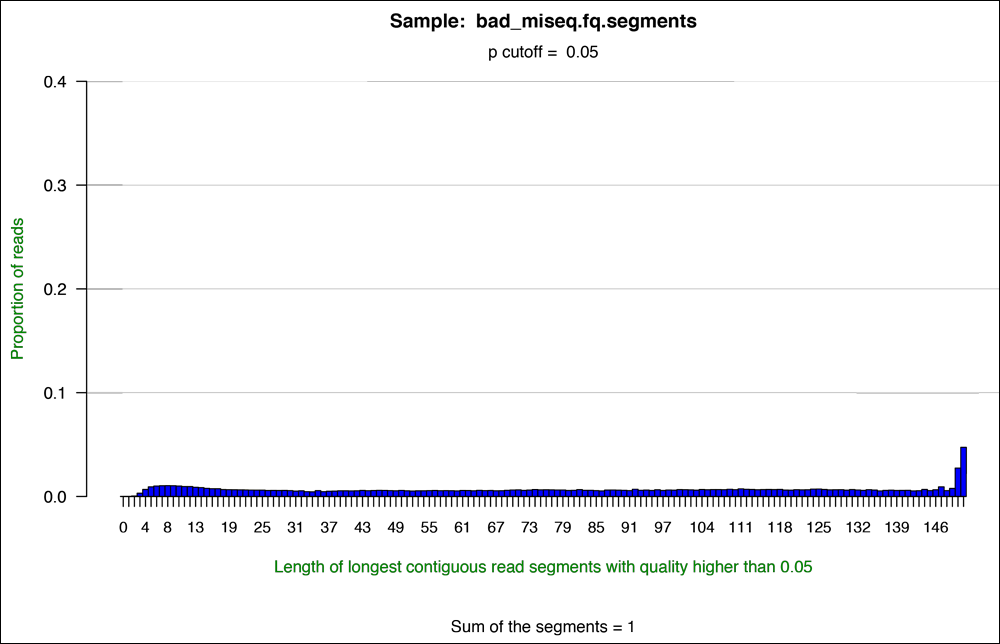
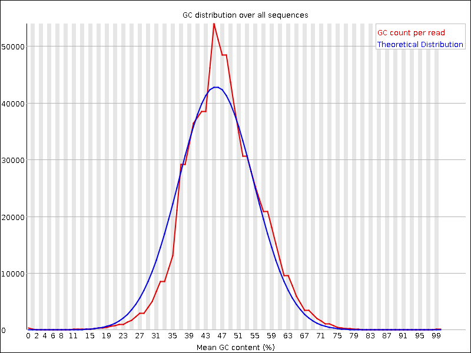

# An introduction to genome assemblies


## 1.0 Preface

In this genome assembly tutorial we will use our skill on the command-line interface to deal with the task of a genome assembly. You will learn how to judge the sequencing quality of a next generation sequencing (NGS) run and assemble the genome based on a collection of short sequences.

You will encounter some **To-do** sections at times. Write the solutions and answers into a text-file.

A PDF-version of this tutorial can be downloaded  [here](http://compbio.massey.ac.nz/courses/bioinf-workshop/genome-assembly/doc/GenomeAssembly_sschmeier.pdf) or  [here](doc/GenomeAssembly_sschmeier.pdf).


## 1.1 Learning outcomes
1. Being able to compute, investigate and evaluate the quality of sequence data from a sequencing experiment.
2. Being able to compute, interpret and evaluate a whole genome assembly.
3. Being able to judge the quality of a genome assembly.


## 1.2. The data
###  1.2.1 Get the data
You can download the data-file [here](data/eli.low10paired.fastq.gz) ([alternative link](http://compbio.massey.ac.nz/courses/bioinf-workshop/genome-assembly/data/eli.low10paired.fastq.gz)). I will also bring the data on a USB drive, please copy it onto your system should the download not work.

The data is a down-sampled (randomly selected) small portion of the original sequencing data-set. This has been done because the amount of data produced was too high for the exercises today. Also, the original data was paired-end data, thus we had two files, one for each end. The paired-data here was already combined into one file.


### 1.2.2 Investigate the data
Make use of your newly developed skills on the command-line to investigate the files in two folders.

**To-do**
1. Unzip the data using `gzip`.
2. Use the command-line to get some ideas about the file.
3. What kind of files are we dealing with?
4. How many sequence reads are in the file?


## 1.3 Quality assessment of sequencing reads (SolexaQA++)

To assess the sequence read quality of the Illumina run we make use of a program called [SolexaQA](http://solexaqa.sourceforge.net/). This was originally developed to work with Solexa data (since bought by Illumina), but long since working with Illumina data. It produces nice graphics that intuitively show the quality of the sequences. it is alos able to dynamically trim the bad quality ends off the reads.

From the webpage:

> "SolexaQA calculates sequence quality statistics and creates visual representations of data quality for second-generation sequencing data. Originally developed for the Illumina system (historically known as "Solexa"), SolexaQA now also supports Ion Torrent and 454 data."


### 1.3.1 Download/install SolexaQA++
Download [SolexaQA](http://solexaqa.sourceforge.net/) from the developer webpage [here](http://downloads.sourceforge.net/project/solexaqa/src/SolexaQA%2B%2B_v3.1.3.zip?r=http%3A%2F%2Fsourceforge.net%2Fprojects%2Fsolexaqa%2Ffiles%2F&ts=1437361945&use_mirror=iweb).

Note! Emergency link **[here](apps/SolexaQA++_v3.1.3.zip)** ([alternative link](http://compbio.massey.ac.nz/courses/bioinf-workshop/genome-assembly/apps/SolexaQA++_v3.1.3.zip)).

```bash
# unzip the archive
$ unzip SolexaQA++_v3.1.3.zip
# make the file executable
$ chmod a+x SolexaQA++_v3.1.3/Linux_x64/SolexaQA++
# copy the executable to my working directory
$ cp ./SolexaQA++_v3.1.3/Linux_x64/SolexaQA++ .
# run the program
$ ./SolexaQA++
# should now run the program
```


### 1.3.2 Understand SolexaQA++
`SolexaQA++` has three modes that can be run. Type:

```bash
$ ./SolexaQA++
```

```bash
SolexaQA++ v3.1.3
Released under GNU General Public License version 3
C++ version developed by Mauro Truglio (M.Truglio@massey.ac.nz)

Usage: SolexaQA++ <command> [options]

Command: analysis	quality analysis and graphs generation
         dynamictrim	trim reads using a chosen threshold
	     lengthsort	sort reads by a chosen length

```

The three modes are: `analysis`, `dynamictrim`, and `lengthsort`

`analysis` - the primary quality analysis and visualization tool. Designed to run on unmodified FASTQ files obtained directly from Illumina, Ion Torrent or 454 sequencers.

`dynamictrim` - a read trimmer that individually crops each read to its longest contiguous segment for which quality scores are greater than a user-supplied quality cutoff.

`lengthsort` - a program to separate high quality reads from low quality reads. LengthSort assigns trimmed reads to paired-end, singleton and discard files based on a user-defined length cutoff.


### 1.3.3 Run SolexaQA++ on untrimmed data
**To-do**
1. Create a directory for the result-files --> **qa_untrimmed/**.
2. Run SolexaQA++ with the untrimmed data, and submit result-directory **qa_untrimmed/**.
3. Investigate the result-files in **qa_untrimmed/**.
4. Compare your results to these examples of a particularly bad run (*Figure 1-4*, taken from [http://solexaqa.sourceforge.net/](http://solexaqa.sourceforge.net/)).
5. What elements in these figures (Figure1-4) show that we are dealing with a bad run?


Hint! Should you not get 1 and/or 2 it right, try these commands [here](code/solexaqa1.txt) ([alternative link](http://compbio.massey.ac.nz/courses/bioinf-workshop/genome-assembly/code/solexaqa1.txt)).


*Figure 1: SolexaQA++ quality plot along reads*


*Figure 2: SolexaQA++ histogram plot.*


*Figure 3: SolexaQA++ cumulative plot.*


*Figure 4: SolexaQA++ quality heatmap*


### 1.3.4 Dynamic trim the data
Despite what you may have found out about the untrimmed data, it is a good idea to trim the data before further analyses.

**To-do**
1. Create a directory for the result-files --> **qa_toTrimmed/**
2. Use SolexaQA++ to trim the reads based on quality and a probability cutoff of 0.01.

Hint! Should you not get 1 and/or 2 it right, try these commands [here](code/solexaqa2.txt) ([alternative link](http://compbio.massey.ac.nz/courses/bioinf-workshop/genome-assembly/code/solexaqa2.txt)).


### 1.3.5 Run SolexaQA++ on trimmed data
**To-do**
1. Create a directory for the result-files --> **qa_trimmed/**.
2. Do the quality assessment again with the trimmed data-set.
3. Compare the results in **qa_trimmed/** to the untrimmed results in **qa_untrimmed/**.

Hint! Should you not get 1 and/or 2 it right, try these commands [here](code/solexaqa3.txt) ([alternative link](http://compbio.massey.ac.nz/courses/bioinf-workshop/genome-assembly/code/solexaqa3.txt)).


## 1.4 Quality assessment of sequencing reads (FastQC)

### 1.4.1 Download/install FastQC (might already be installed)
Download [FastQC](http://www.bioinformatics.babraham.ac.uk/projects/fastqc/) from the developer webpage [here](http://www.bioinformatics.babraham.ac.uk/projects/fastqc/fastqc_v0.11.3.zip).

Note! Emergency link [here](apps/fastqc_v0.11.3.zip).

```bash
# Download file on the command-line
$ wget http://www.bioinformatics.babraham.ac.uk/projects/fastqc/fastqc_v0.11.3.zip
# Unzip the archive
$ unzip fastqc_v0.11.3.zip
# copy the program to the working directory
$ cp ./FastQC/fastqc .
# run the program
$ ./fastqc --help
# should now run the program
```

```bash

            FastQC - A high throughput sequence QC analysis tool

SYNOPSIS

        fastqc seqfile1 seqfile2 .. seqfileN

    fastqc [-o output dir] [--(no)extract] [-f fastq|bam|sam]
           [-c contaminant file] seqfile1 .. seqfileN

DESCRIPTION

    FastQC reads a set of sequence files and produces from each one a quality
    control report consisting of a number of different modules, each one of
    which will help to identify a different potential type of problem in your
    data.

    If no files to process are specified on the command line then the program
    will start as an interactive graphical application.  If files are provided
    on the command line then the program will run with no user interaction
    required.  In this mode it is suitable for inclusion into a standardised
    analysis pipeline.
```


### 1.4.2 Understand FastQC
FastQC is a very simple program to run that provides similar and additional information to SolexaQA++.

From the webpage:

> FastQC aims to provide a simple way to do some quality control checks on raw sequence data coming from high throughput sequencing pipelines. It provides a modular set of analyses which you can use to give a quick impression of whether your data has any problems of which you should be aware before doing any further analysis.

The basic command looks like:

```bash
$ fastqc -o result-dir/ input-file.[txt/fa/fq] ...
```

- `-o result-dir/` is the directory where the result files will be written
- `input-file.[txt/fa/fq]` is the sequence file to analyze, can be more than one file.

The result will be a HTML page per input file that can be opened in a web-browser.


### 1.4.3 Run FastQC on the untrimmed and trimmed data
**To-do**
1. Create a directory for the results --> **fastqc_results/**
2. Run FastQC with both files
3. Compare the two result-files in a browser
4. Compare your results to these examples (*Figure 5-6*) of a particularly bad run (taken from [http://www.bioinformatics.babraham.ac.uk/projects/fastqc/](http://www.bioinformatics.babraham.ac.uk/projects/fastqc/).
5. What elements in these figures (Figure1-4) show that we are dealing with a bad run?

Hint! Should you not get it right, try these commands [here](code/fastqc.txt) ([alternative link](http://compbio.massey.ac.nz/courses/bioinf-workshop/genome-assembly/code/fastqc.txt)).


*Figure 5: Quality score across bases.*


*Figure 6: Quality per tile.*


*Figure 7: GC distribution over all sequences.*


## 1.5 Whole genome assembly (velvet)

[Velvet](https://www.ebi.ac.uk/~zerbino/velvet/) is a de Bruijn graph assembly program. It is developed with the aim of assembling very short reads like in our case.

From the webpage:

> Velvet is a de novo genomic assembler specially designed for short read sequencing technologies, such as Solexa or 454. Velvet currently takes in short read sequences, removes errors then produces high quality unique contigs. It then uses paired-end read and long read information, when available, to retrieve the repeated areas between contigs.

### 1.5.1 Download/install Velvet (might already be installed)
Download [Velvet](https://www.ebi.ac.uk/~zerbino/velvet/) from the developer website [here](https://www.ebi.ac.uk/~zerbino/velvet/velvet_1.2.10.tgz).

Note! Emergency download-link **[here](apps/velvet_1.2.10.tgz)** ([alternative link](http://compbio.massey.ac.nz/courses/bioinf-workshop/genome-assembly/apps/velvet_1.2.10.tgz)).

```bash
# unzip
$ gunzip velvet_1.2.10.tgz
# extract the archive
$ tar xvf velvet_1.2.10.tar
# change directory
$ cd velvet_1.2.10/
# compile program
$ make 'MAXKMERLENGTH=63'
# this will take a few seconds
# we have now two programs: velveth and velvetg

# copy these to your home directory
```

### 1.5.2 Understanding Velvet
Velvet uses two different programs sequentially to achieve the assembly. You have to use them one at a time. You should familiarize yourself with the structure of the program calls. Once you understand this it is very easy to change things around.


**`velveth`**


This program is a hashing program. It basically prepares your data for the assembler `velvetg`. An example program call looks like:

```bash
# Running velveth without parameters gives you a help page
$ ./velveth
# Here a complete example call
$ ./velveth results_directory/ 63 -fastq -shortPaired input_seqs.fastq
```

- `./velveth` the program inlcuding the full path where the program is located
- `result_directory/` the directory where you want the results to be saved
- `63` the kmer value
- `-fastq` specifies the input sequence-file type
- `-shortPaired` the type of the reads (here short paired reads)
- `input_seqs.fastq` the file-name of the input data


**`velvetg`**


This program is the core  of velvet and the actual assembler. An example program call looks like this:

```bash
$ ./velvetg result_directory/ -cov_cutoff 10 -exp_cov 30
       -min_contig_lgth 500 -ins_length 300
```

- `./velvetg` the program including the full path where the program is located
- `result_directory/` the directory where you want the results to be saved
- `-cov_cutoff 10` removal of low coverage nodes AFTER tour bus or allow the system to infer it [do not worry about this]
- `-exp_cov 30` the expected coverage of unique regions or allow the system to infer it [do not worry about this]
- `-min_contig_lgth 500` the minimum size of contig to report back (to exclude tiny ones we only look at contigs >500bp)
- `-ins_length 300` expected distance between two paired-end reads in the respective short-read dataset

### 1.5.3 Run Velvet with untrimmed data
**To-do**
1. Make sure you have the untrimmed data and you know where it is.
2. Create a directory for the results --> `velvet_untrimmed/`
3. Run velveth with the data `eli.low10paired.fastq`
4. Run velvetg

Hint! Should you not get it right, try these commands [here](code/velvet1.txt) ([alternative link](http://compbio.massey.ac.nz/courses/bioinf-workshop/genome-assembly/code/velvet1.txt)).

### 1.5.4 Run Velvet with trimmed data
**To-do**
1. Make sure you have the trimmed data and you know where it is.
2. Create a directory for the results --> `velvet_trimmed/`
3. Run velveth with the data `qa_toTrimmed/eli.low10paired.fastq.trimmed`
4. Run velvetg

Hint! Should you not get it right, try these commands [here](code/velvet2.txt) ([alternative link](http://compbio.massey.ac.nz/courses/bioinf-workshop/genome-assembly/apps/code/velvet2.txt)).

### 1.5.5 Evaluate assemblies
**To-do**
1. Look at the Log files from trimmed and untrimmed assemblies.
2. Look at the stat.txt files from trimmed and untrimmed assemblies.
3. Look at the contigs.fa files of the trimmed and untrimmed assemblies.
4. What can we say about the the assemblies?
5. How does untrimmed and trimmed compare?
6. What can you say about the trimming procedure in light of assembling sequences?

### 1.5.6 Visualize assemblies
[Bandage](https://rrwick.github.io/Bandage/)

### 1.5.7 Assembly quality assessment
[Quast](http://quast.bioinf.spbau.ru/), download link [here](http://downloads.sourceforge.net/project/quast/quast-3.0.tar.gz?r=http%3A%2F%2Fsourceforge.net%2Fprojects%2Fquast%2Ffiles%2F&ts=1437367168&use_mirror=tcpdiag).


## 1.6 Genome annotation
Genome annotation pipeline [RAST](http://rast.nmpdr.org/)

Phage-specific annotation pipeline [PHAST](http://phast.wishartlab.com/)


## 1.7 What's next?
Next steps could include:
- map all reads to the "new" genome
- look at the aligned reads in a genome viewer
- predict genes in the "new" genome
- overlay gene information with aligned reads in the genome viewer
- etc.

**_File: index.md - PDF-version: [link1](http://compbio.massey.ac.nz/courses/bioinf-workshop/genome-assembly/doc/GenomeAssembly_sschmeier.pdf) | [link2](doc/GenomeAssembly_sschmeier.pdf) - Sebastian Schmeier - Last update: 2015-07-22_**
