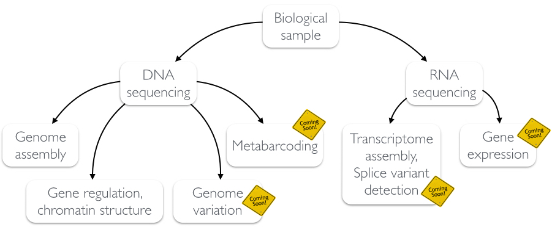

# Bioinformatics workshop
These web-pages contain several introductory and eventually advanced tutorials on bioinformatics tools and analyses.

Pages are hosted by [Sebastian Schmeier](http://compbio.massey.ac.nz/schmeier) at [Massey University](http://compbio.massey.ac.nz/courses/bioinf-workshop/) as well as on [github](http://sschmeier.github.io/bioinf-workshop/).

## Contents

| Topic | Online tutorial |   | Presentation |
|-------|-----------------|:-:|--------------|
| 1 | [An introduction to the command-line interface](cli/index.md) | [](cli/doc/AnIntroductionToTheCLI_sschmeier.pdf) | [Bioinformatics introduction](http://dx.doi.org/10.6084/m9.figshare.1506799) |
| 2 | [An introduction to genome assemblies](genome-assembly/index.md) | [](genome-assembly/doc/GenomeAssembly_sschmeier.pdf) | [Next-generation sequencing and quality control: An introduction](https://dx.doi.org/10.6084/m9.figshare.2972320.v1) |
|  |  |  | [Genome Assembly: An Introduction](https://dx.doi.org/10.6084/m9.figshare.2972323.v1)  |
| 3 | [An introduction to Galaxy](galaxy-intro/index.md) | [](galaxy-intro/doc/AnIntroductionToGalaxy_sschmeier.pdf) | [UCSC Genome/Table browser](http://dx.doi.org/10.6084/m9.figshare.1537482) |
|  |  |  | [A very short Galaxy introduction](http://dx.doi.org/10.6084/m9.figshare.1537481) |
| 4 | [An introduction to ChIP-seq analysis with Galaxy](galaxy-chipseq/index.md) | [](galaxy-chipseq/doc/Galaxy-ChIPseq-Introduction_sschmeier.pdf) | [ChIP-seq introduction ](http://dx.doi.org/10.6084/m9.figshare.1545468) |
|  |  |  | [ChIP-seq data processing](http://dx.doi.org/10.6084/m9.figshare.1554130) |
| 5 | [An introduction to variant calling]() | [](galaxy-variant-calling/doc/Galaxy-Variant-Calling-Introduction_sschmeier.pdf)  | [SNPs - GWAS - eQTLs introduction](http://dx.doi.org/10.6084/m9.figshare.1515026) |
|  |  |  | [Variant calling data processing]() |

## Analyses overview



## Housekeeping
While you browse these sites and tutorials, you will encounter specifically highlighted sections:

**A code-block:**

```bash
## This is either SHELL-code or a programming language code, e.g. R or python
>figlet -f script "Bioinformatics"
, __                     _
/|/  \o       o          | |                                o
| __/    __      _  _   | |  __   ,_    _  _  _    __, _|_     __   ,
|   \|  /  \_|  / |/ |  |/  /  \_/  |  / |/ |/ |  /  |  |  |  /    / \_
|(__/|_/\__/ |_/  |  |_/|__/\__/    |_/  |  |  |_/\_/|_/|_/|_/\___/ \/
                        |\
                        |/
```

**Something of interest**

Note! This might be of interest.

**Some hint**

Hint! This is a hint

**Some warning**

Attention! This is important.
