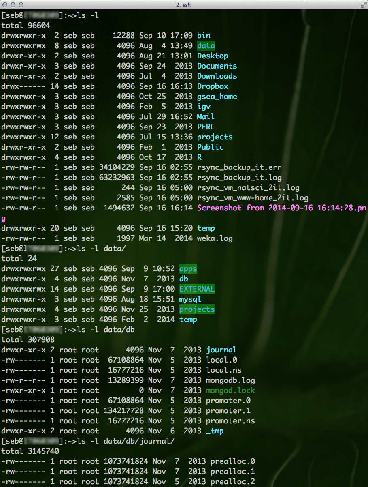

# Unix/Linux command-line tutorial


This tutorial is based on a Linux/Unix _command-line_. Using the _command-line_ requires a Linux/Unix operating system. The easiest way to try out a Linux system without actually installing it on your computer is a [LiveCD](https://en.wikipedia.org/wiki/Live_CD). A LiveCD is a DVD that you prepare (e.g. burn a Linux distribution on it) and insert in your computer. You would restart you computer and can run Linux from the DVD without any installation requirements. This is helpful for trying out a distribution of Linux not for actual work.

Another route would be to use a virtual machine. Software to create a virtual machine is free, e.g. [VirtualBox](https://www.virtualbox.org/).

Common flavors of Linux ready for download are e.g. [Ubuntu](https://help.ubuntu.com/community/LiveCD) or if you are thinking of going the bioinformatics route, [BioLinux](http://environmentalomics.org/bio-linux/), which includes many pre-installed bioinformatics tools.

## 0. Learning outcomes
1. Be able to operate comfortably the Linux command-line.
2. Be able to navigate the unix directory structure
3. Be able to start command-line programs and getting help/information about programs
4. Be able to explain the concept of a unix pipe

## 1.1 Introduction
This is a collection of commands and programs I put together for working under Linux/Unix shells. It is not comprehensive. It includes very basic stuff. Tutorial style. This is bash syntax but most of it  will work on other shells (tcsh, sh) as well.

You need a editor use nedit, gedit, emacs. Editing on the shell: emacs -nw or vi.

Hint! If you see a **_grey_** box, this means this is code and you can paste it into the command-line and hit "Enter" to run it. If you see a "**_#_**" at the start of a line, this denotes a comment.

Open a terminal window and you are are ready to go.

## 1.2 Some words regarding the linux file-system


The directory structure in a Linux system is not much different from an other system you worked with. It is essentially a tree structure. The way you navigate in the file-system can be via a file-manager e.g. Nautilus.


The difference is how you navigate the directory structure on the command-line. Why is this necessary? Strictly speaking it is not, if you do not want to make use of programs on the command-line. However, the power of the Linux system becomes only obvious once we learn to make use of the command-line, thus navigating the directory structure via commands is an important skill to know.

## 1.3 Let's get started
**Help about a program e.g. 'ls':**

```bash
man pwd
pwd -h
```

Another very helpful resource is the [explainshell.com ](http://www.explainshell.com) webpage,  that lets you write down a _command-line_ to see the help text that matches each argument.

**Investigate directory / list directory:**

```bash
# what directory am I in?
pwd
# you should see something like /home/seb

# list the current directory elements implicitly
ls
# the same in a nicer format
ls -l
```



**Moving around in the file system**

```bash
# Lets create a directory
mkdir temp

# List a particular directory (e.g. temp/) explicitly
ls temp/

# change into directory "temp" with command "cd" (change directory)
cd temp/
pwd
# you should see something like /home/seb/temp

# Go one directory up in the directory tree
cd ..
pwd
# back to /home/seb

# Go to your home directory from any position in the directory tree
cd

# A shortcut for the home directory is ~/
# This command will change to /home/user/temp from any position in the directory tree
cd ~/temp
```

## 1.4 File-handling
**Create a new empty text-file:**

```bash
# first change into the temp directory
cd temp
# now create empty file
touch file1.txt
```

**Delete a file (_caution_)**

```bash
rm file1.txt
```

Warning! Avoid using "rm *". This will erase all files in the directory.

**Copy a file (file1.txt) to another location or file**

```bash
# create empty file again
touch file1.txt
cp file1.txt file2.txt
```

**Copy directories**

```bash
cp -r dir1 dir2
# will not work because there is not a directory "dir1"
```

**Move a file/directory**

```bash
# move files
mv file1.txt file2.txt
# move directories
mv dir1 dir2
# again will not work because we miss "dir1"
```

**Delete a dir:**

```bash
rm -r temp/
```

## 1.5 Investigate files
Note! Download two sample-files [here](data/file1.txt) and [here](data/file2.txt).

**Look into files**

```bash
less file1.txt
# move line down with "j", up with "k", you can get out of it with "q"
less file2.txt
```

**Print head/tail of files**

```bash
# first 15 lines:
head -15 file1.txt
# last 15 lines:
tail -15 file1.txt
```

**Concatenate content of files -> will print on stdout:**

```bash
cat file1.txt file2.txt
# all files starting with "file":
cat file*
# print content from one file to stdout:
cat file1.txt
```

**Count number of rows of a file:**

```bash
wc -l file1.txt
```

**Sorting files**

```bash
# sort on complete line:
sort file1.txt

# sort a comma-seperated file on second field:
sort -t ',' -k2,2 file1.txt

# sort a comma-seperated file on second field according to numbers
sort -t ',' -k2,2n file1.txt
```

**Extract columns of a file**

```bash
# cut -d'seperator' -fCOLUMN,COLUMN,...  file.txt, e.g.
cut -d ',' -f 1,3-5 file1.txt
```

**Search for pattern in a file. grep/egrep**

```bash
# print only lines of a file that contain a pattern:
grep 'AAA' file1.txt

# print only lines that do _not_ contain the pattern:
grep -v 'AAA' file1.txt
```

## 1.6 Compression magic
**First we compress a single file:**

```bash
gzip file1.txt
# will produce a file called file1.txt.gz in gzip format, and delete file1.txt
```

**We do not need to decompress a file to use look at its content (most of my text files are stored in gzip format):**

```bash
zless file1.txt.gz
zcat file1.txt.gz
zcat file1.txt.gz
```

**Extract a single gzipped-file:**

```bash
gzip -d file1.txt.gz
```

**Compress using zip:**

```bash
zip file.zip file1.txt
```

**Extract a zipped-file:**

```bash
unzip file1.zip
```

## 1.7 The pipe operator
**_File: index.md - Sebastian Schmeier - Last update: 2015-07-10_**
