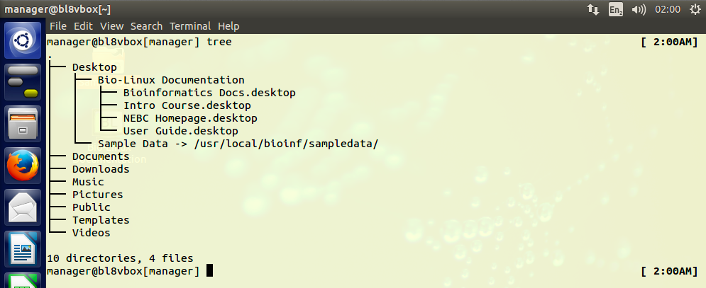

# 246.201 Systems and Models - Week 1


[1]: https://en.wikipedia.org/wiki/Live_CD "Wiki: LiveCD"

## 0. Learning outcomes
  1. Being able to operate comfortably the Linux command-line.
  2. Being able to compute, investigate and evaluate the quality data from a sequencing experiment.
  3. Being able to compute, interpret and evaluate a whole genome assembly.

## 1. Linux/Unix command-line intro

This tutorial is based on a Linux/Unix *command-line*. Using the *command-line* requires a Linux/Unix operating system. The easiest way to try out a Linux system without actually installing it on your computer is a [LiveCD][1]. A LiveCD is a DVD that you prepare (e.g. burn a Linux distribution on it) and insert in your computer. You would restart you computer and can run Linux from the DVD without any installation requirements. This is helpful for trying out a distibution of Linux not for actual work.

Another route would be to use a virtual machine. Software to create a virtual machine is free, e.g. [VirtualBox](https://www.virtualbox.org/). 

Common flavors of Linux ready for download are e.g. [Ubuntu](https://help.ubuntu.com/community/LiveCD) or if you are thinking of going the bioinformatics route, [BioLinux](http://environmentalomics.org/bio-linux/), which includes many pre-installed bioinformatics tools.

##1.1 Introduction
This is a collection of commands and programs I put together for working under Linux/Unix shells. It is not comprehensive. It includes very basic stuff. Tutorial style. This is bash syntax but most of it  will work on other shells (tcsh, sh) as well.

You need a editor use nedit, gedit, emacs. Editing on the shell: emacs -nw or vi.

Hint! If you see a **_grey_** box, this means this is code and you can paste it into the command-line and hit "Enter" to run it. If you see a "**_#_**" at the start of a line, this denotes a comment.

Open a terminal window and you are are ready to go.

##1.2 Some words regarding the linux file-system



The directory structure in a Linux system is not much different from an other system you worked with. It is essentially a tree structure. The way you navigate in the file-system can be via a file-manager e.g. Nautilus.


The difference is how you navigate the directory structure on the command-line. Why is this necessary? Strictly speaking it is not, if you do not want to make use of programs on the command-line. However, the power of the Linux system becomes only obvious once we learn to make use of the command-line, thus navigating the diectory structure via commands is an important skill to know.

##1.3 Let's get started

**Help about a program e.g. 'ls':**

```bash
man pwd
pwd -h
```
Another very helpful resource is the [explainshell.com ](http://www.explainshell.com ) webpage,  that lets you write down a *command-line* to see the help text that matches each argument.

**Investigate directory / list directory:**

```bash
# what directory am I in?
pwd
# you should see somehting like /home/seb

# list the current directory elements implicitly 
ls
# the same in a nicer format
ls -l
```


**Moving arround in the file system**

```bash
# Lets create a directory
mkdir temp

# List a particular directory (e.g. temp/) explicitly
ls temp/

# change into directory "temp" with command "cd" (change directory)
cd temp/
pwd
# you should see something like /home/seb/temp

# Go one directory up in the directory tree
cd ..
pwd
# back to /home/seb

# Go to your home directory from any position in the directory tree
cd

# A shortcut for the home directory is ~/
# This command will change to /home/user/temp from any position in the directory tree
cd ~/temp
```


##1.4 File-handling
**Create a new empty text-file:**

```bash
# first change into the temp directory
cd temp
# now create empty file
touch file1.txt
```

**Delete a file (*caution*)**

```bash
rm file1.txt
```
Warning! Avoid using "rm *". This will erase all files in the directory.

**Copy a file (file1.txt) to another location or file**

```bash
# create empty file again
touch file1.txt
cp file1.txt file2.txt
```

**Copy directories**

```bash
cp -r dir1 dir2
# will not work because there is not a directory "dir1"
```

**Move a file/directory**

```bash
# move files
mv file1.txt file2.txt
# move directories
mv dir1 dir2
# again will not work because we miss "dir1"
```

**Delete a dir:**

```bash
rm -r temp/
```

##1.5 Investigate files
Note! Download two sample-files [here](http://compbio.massey.ac.nz/wiki/courses/2014_246201/week1/data/file1.txt) and [here](http://compbio.massey.ac.nz/wiki/courses/2014_246201/week1/data/file2.txt).

**Look into files**

```bash
less file1.txt
# move line down with "j", up with "k", you can get out of it with "q"
less file2.txt
```

**Print head/tail of files**

```bash
# first 15 lines:
head -15 file1.txt
# last 15 lines:
tail -15 file1.txt
```

**Concatenate content of files -> will print on stdout:**

```bash
cat file1.txt file2.txt
# all files starting with "file":
cat file*
# print content from one file to stdout:
cat file1.txt
```

**Count number of rows of a file:**

```bash
wc -l file1.txt
```

**Sorting files**

```bash
# sort on complete line:
sort file1.txt

# sort a comma-seperated file on second field: 
sort -t ',' -k2,2 file1.txt

# sort a comma-seperated file on second field according to numbers
sort -t ',' -k2,2n file1.txt
```

**Extract columns of a file**

```bash
# cut -d'seperator' -fCOLUMN,COLUMN,...  file.txt, e.g.
cut -d ',' -f 1,3-5 file1.txt
```

**Search for pattern in a file. grep/egrep**

```bash
# print only lines of a file that contain a pattern:
grep 'AAA' file1.txt

# print only lines that do _not_ contain the pattern:
grep -v 'AAA' file1.txt
```

##1.6 Compression magic

**First we compress a single file:**

```bash
gzip file1.txt
# will produce a file called file1.txt.gz in gzip format, and delete file1.txt
```

**We do not need to decompress a file to use look at its content (most of my text files are stored in gzip format):**

```bash
zless file1.txt.gz
zcat file1.txt.gz 
zcat file1.txt.gz
```

**Extract a single gzipped-file:**

```bash
gzip -d file1.txt.gz
```

**Compress using zip:**

```bash
zip file.zip file1.txt
```

**Extract a zipped-file:**

```bash
unzip file1.zip
```

##2. Get the data
You can download the data-file [here](http://compbio.massey.ac.nz/wiki/courses/2014_246201/week1/data/eli.low10paired.fastq.gz). I will also bring the data on a USB drive, please copy it onto your system should the download not work.

The data is a down-sampled (randomly selected) small portion of the original sequencing data-set. This has been done because the amount of data produced was too high for this exercises today. Also, the original data was paired-end data, thus we had two files, one for each end. The paired-data here was already combined into one file.

##2.1 Investigate the data
Make use of your newly developed skills on the command-line to investigate the files in two folders.

**To-do:**
  1. Unzip the data using ```gzip```.
  2. What kind of files are we dealing with?
  3. How many sequence reads are in the file?

##3. Quality asssessment sequencing reads
To assess the sequence read quality of the Illumina run we make use of a program called [SolexaQA](http://solexaqa.sourceforge.net/). This was originally developed to work with Solexa data (since bought by Illumina), but long since working with Illumina data. It produces nice graphics that intuitively show the quality of the sequences. it is alos able to dynamically trim the bad quality ends off the reads.

From the webpage:

>SolexaQA calculates sequence quality statistics and creates visual representations of data quality for second-generation sequencing data. Originally developed for the Illumina system (historically known as “Solexa”), SolexaQA now also supports Ion Torrent and 454 data.


##3.1 Download/install SolexaQA++ (hopefully not necessary)
Download [SolexaQA](http://solexaqa.sourceforge.net/) from the developer webpage [here](http://downloads.sourceforge.net/project/solexaqa/src/SolexaQA%2B%2B_v3.0.zip?r=http%3A%2F%2Fsourceforge.net%2Fprojects%2Fsolexaqa%2Ffiles%2Fsrc%2F&ts=1410759802&use_mirror=iweb).

Note! Emergency link [here](http://compbio.massey.ac.nz/wiki/courses/2014_246201/week1/apps/SolexaQA++_v3.0.zip).

```bash
unzip SolexaQA++_v3.0.zip
chmod a+x SolexaQA++_v3.0/Linux_x64/SolexaQA++
./SolexaQA++_v3.0/Linux_x64/SolexaQA++
# should now run the program
```

##3.2 Understand SolexaQA++
SolexaQA++ has three modes that can be run. Type:

```bash
SolexaQA++ 
```
This results in:


The three modes are: ```analysis```, ```dynamictrim```, and ```lengthsort```

```analysis``` - the primary quality analysis and visualization tool. Designed to run on unmodified FASTQ files obtained directly from Illumina, Ion Torrent or 454 sequencers.

```dynamictrim``` - a read trimmer that individually crops each read to its longest contiguous segment for which quality scores are greater than a user-supplied quality cutoff.

```lengthsort``` - a program to separate high quality reads from low quality reads. LengthSort assigns trimmed reads to paired-end, singleton and discard files based on a user-defined length cutoff. 

##3.2 Run SolexaQA++ on untrimmed data
**To-do:**
 1. Create a directory for the result-files --> ```qa_untrimmed/```
 2. Run SolexaQA++ with the untrimmed data, and submit result-directory ```qa_untrimmed/```.
 3. Investigate the result-files in ```qa_untrimmed/```.

Hint! Should you not get 1 and/or 2 it right, try these commands [here](http://compbio.massey.ac.nz/wiki/courses/2014_246201/week1/code/solexaqa1.txt).

Compare your results to these examples of a particularly bad run (taken from [http://solexaqa.sourceforge.net/](http://solexaqa.sourceforge.net/)).
**What can we say about our data?**


##3.3 Dynamic trim the data
Despite what you may have found out about the untrimmed data, it is a good idea to trim the data before further analyses.

**To-do:**
  1. Create a directory for the result-files --> ```qa_toTrimmed/```
  2. Use SolexaQA++ to trim the reads based on quality and a probability cutoff of 0.01.

Hint! Should you not get 1 and/or 2 it right, try these commands [here](http://compbio.massey.ac.nz/wiki/courses/2014_246201/week1/code/solexaqa2.txt).

##3.4 Run SolexaQA++ on trimmed data
**To-do:**
  1. Create a directory for the result-files --> ```qa_trimmed/```.
  2. Do the quality assessment again with the trimmed data-set.
  3. Compare the results in ```qa_trimmed/``` to the untrimmed results in ```qa_untrimmed/```.

Hint! Should you not get 1 and/or 2 it right, try these commands [here](http://compbio.massey.ac.nz/wiki/courses/2014_246201/week1/code/solexaqa3.txt).

##3.5 Download/install FastQC (hopefully not necessary)
Download [FastQC](http://www.bioinformatics.babraham.ac.uk/projects/fastqc/) from the developer webpage [here](http://www.bioinformatics.babraham.ac.uk/projects/fastqc/fastqc_v0.11.2.zip).

Note! Emergency link [here](http://compbio.massey.ac.nz/wiki/courses/2014_246201/week1/apps/fastqc_v0.11.2.zip).

```bash
unzip fastqc_v0.11.2.zip
./FastQC/fastqc --help
# should now run the program
```

##3.6 Understand FastQC
FastQC is a very simple program to run that provides similar and additional information to SolexaQA++.

From the webpage:

>FastQC aims to provide a simple way to do some quality control checks on raw sequence data coming from high throughput sequencing pipelines. It provides a modular set of analyses which you can use to give a quick impression of whether your data has any problems of which you should be aware before doing any further analysis. 

The basic command looks like:

```bash
fastqc -o result-dir/ input-file.[txt/fa/fq] ...
```

  * ```-o result-dir/``` is the directory where the result files will be written
  * ```input-file.[txt/fa/fq]``` is the sequence file to analyze, can be more than one file. 

The result will be a HTML page per input file that can be opened in a web-browser.

##3.7 Run FastQC on the untrimmed and trimmed data
**To-do**
  1. Create a directory for the results --> ```fastqc/```
  2. Run FastQC with both files
  3. Compare the two result-files in a browser

Hint! Should you not get it right, try these commands [here](http://compbio.massey.ac.nz/wiki/courses/2014_246201/week1/code/fastqc.txt).

Compare your results to these examples of a particularly bad run (taken from [http://www.bioinformatics.babraham.ac.uk/projects/fastqc/](http://www.bioinformatics.babraham.ac.uk/projects/fastqc/).


##4. Whole genome assembly


[Velvet](https://www.ebi.ac.uk/~zerbino/velvet/) is a de Bruijn graph-based assembly program. It is developed with the aim of assembling very short reads like in our case.

From the webpage:

>Velvet is a de novo genomic assembler specially designed for short read sequencing technologies, such as Solexa or 454.
>Velvet currently takes in short read sequences, removes errors then produces high quality unique contigs. It then uses paired-end read and long read information, when available, to retrieve the repeated areas between contigs.


##4.1 Download/install Velvet (hopefully not necessary)
Download [Velvet](https://www.ebi.ac.uk/~zerbino/velvet/) from the developer website [here](https://www.ebi.ac.uk/~zerbino/velvet/velvet_1.2.10.tgz).

Note! Emergency download-link [here](http://compbio.massey.ac.nz/wiki/courses/2014_246201/week1/apps/velvet_1.2.10.tgz).


```bash
# unzip
gunzip velvet_1.2.10.tgz
# extract the archive
tar xvf velvet_1.2.10.tar
# change directory
cd velvet_1.2.10/
# compile program
make 'MAXKMERLENGTH=63'
# this will take a few seconds
# we have now two programs: velveth and velvetg
```

##4.2 Understanding Velvet
Velvet uses two different programs sequentially to achieve the assembly. You have to use them one at a time. You should familiarize yourself with the structure of the program calls. Once you understand this it is very easy to change things around.

**```velveth```**

This program is a hashing program. It basically prepares your data for the assembler ```velvetg```. An example program call looks like:

```bash
# Running velveth without parameters gives you a help page
./velveth
# Here a complete example call
./velveth results_directory/ 63 -fastq -shortPaired input_seqs.fastq
```
  * ```./velveth``` the program inlcuding the full path where the program is located
  * ```result_directory/``` the directory where you want the results to be saved
  * ```63``` the kmer value
  * ```-fastq``` specifies the input sequence-file type
  * ```-shortPaired``` the type of the reads (here short paired reads)
  * ```input_seqs.fastq``` the file-name of the input data


**```velvetg```**
This program is the core  of velvet and the actual assembler. An example program call looks like this:

```bash
./velvetg result_directory/ -cov_cutoff 10 -exp_cov 30 -min_contig_lgth 500 -ins_length 300
```
  * ```./velvetg``` the program inlcuding the full path where the program is located
  * ```result_directory/``` the directory where you want the results to be saved
  * ```-cov_cutoff 10``` removal of low coverage nodes AFTER tour bus or allow the system to infer it [do not worry about this]
  * ```-exp_cov 30``` the expected coverage of unique regions or allow the system to infer it [do not worry about this]
  * ```-min_contig_lgth 500``` the minimum size of contig to report back (to exclude tiny ones we only look at contigs >500bp)
  * ```-ins_length 300``` expected distance between two paired-end reads in the respective short-read dataset

##4.3 Run Velvet with untrimmed data
**To-do:**
  1. Make sure you have the untrimmed data and you know where it is.
  2. Create a directory for the results --> ```velvet_untrimmed/```
  3. Run velveth with the data ```eli.low10paired.fastq```
  4. Run velvetg

Hint! Should you not get it right, try these commands [here](http://compbio.massey.ac.nz/wiki/courses/2014_246201/week1/code/velvet1.txt).

##4.4 Run Velvet with trimmed data
**To-do:**
  1. Make sure you have the trimmed data and you know where it is.
  2. Create a directory for the results --> ```velvet_trimmed/```
  3. Run velveth with the data ```qa_toTrimmed/eli.low10paired.fastq.trimmed```
  4. Run velvetg 

Hint! Should you not get it right, try these commands [here](http://compbio.massey.ac.nz/wiki/courses/2014_246201/week1/code/velvet2.txt).

##4.5 Evaluate assemblies
**To-do:**
  1. Look at the Log files from trimmed and untrimmed assemblies.
  2. Look at the stat.txt files from trimmed and untrimmed assemblies.
  3. Look at the contigs.fa files of the trimmed and untrimmed assemblies.
  4. What can we say about the the assemblies?
  5. How does untrimmed and trimmed compare?
  6. What can you say about the trimming procedure in light of assembling sequences?

##5. What's next?
Next steps could include:

  * map all reads to the "new" genome
  * look at the aligned reads in a genome viewer
  * predict genes in the "new" genome
  * overlay gene information with aligned reads in the genome viewer
  * etc.

**_File: index.md - Sebastian Schmeier - Last update: Tue Sep 16 18:21:47 NZST 2014_**
